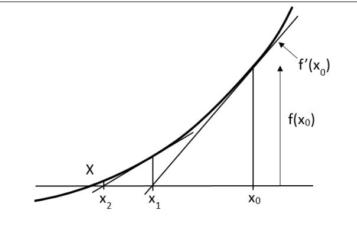
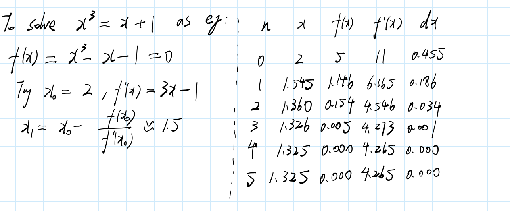
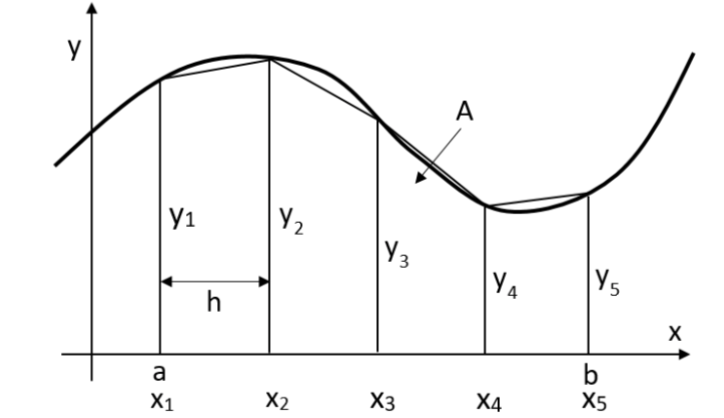
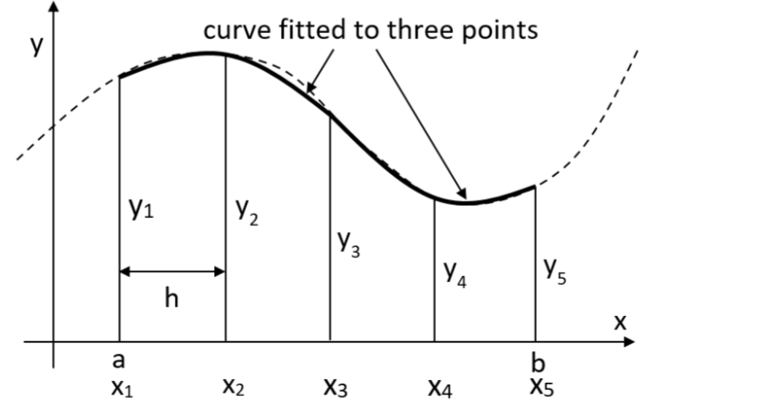
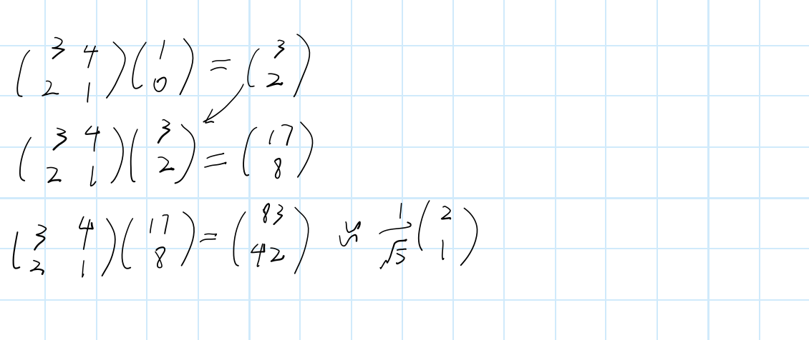
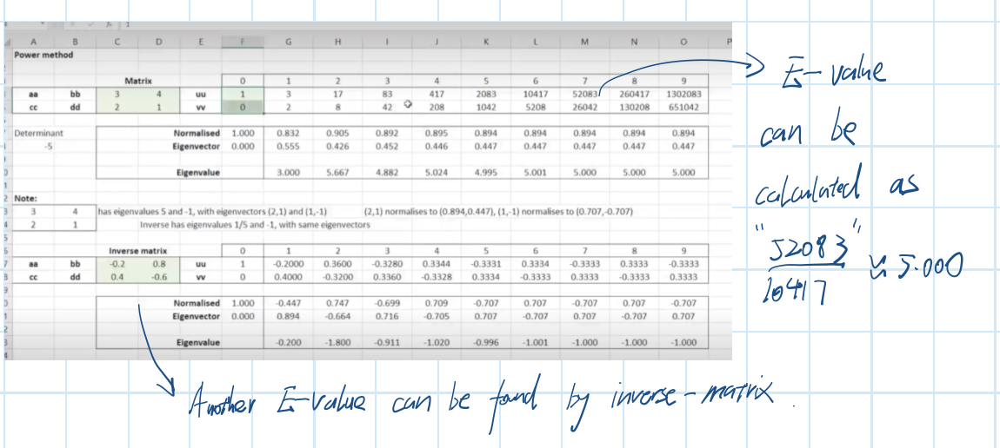
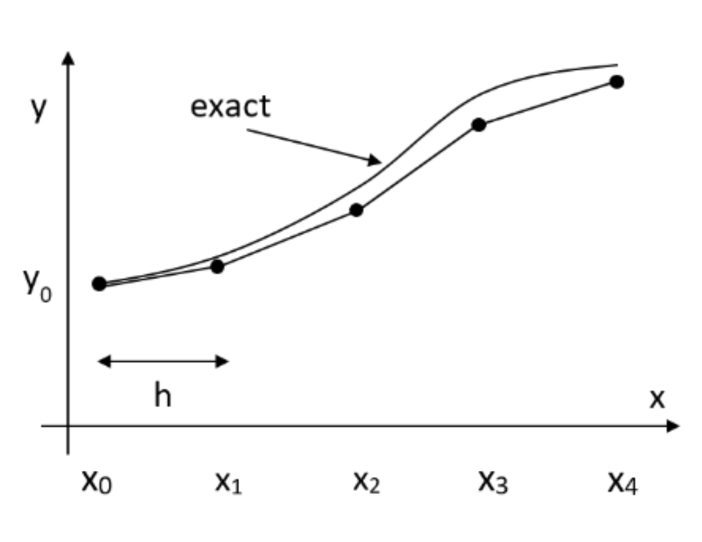

# XI: Numerical Methods 
## 1: Newton-Raphson Methods
* To find the root of the function $f(x)=0$, which is assumed as $x=X$.

* We start from $x_0$, and find the derivate of $(x_0,f(x_0)$), which is $f'(x)$,then we draw the tangent line of this point. This line across with x axis at $x_1$.
* Repeat the operation of $x_0$ with $x_1$, and then $x_2$ ...$x_n$ and so on.
* From the right-angle triangle:
$$
f'(x_0)=\frac{f(x_0)}{x_0-x_1} \\
x_1=x_0-\frac{f(x_0)}{f'(x_0)}
$$
* So that we can find the general formula:
$$
x_{n+1}-x_n-\frac{f(x_n)}{f'(x_n)}
$$
* This is the **Newton-Rephson Method**.
* We always choose 4 significant number of the results, and the answer will be same when n is increasing:

## 2: Numerical integration 
* Sometimes numerical integration is more convenient compared to calculus.
### 2.1: Trapezium rule 
* A simple methods to replace the curve by several short lines and find the sum of the trapezium area.
* If we choose five points and find four trapezium areas as below:

* The answer will be:
$$
A=\displaystyle\int _a^b y{\rm d}x\approx T_4=\frac{h}{2}[y_1+2(y_2+y_3+y_4)+y_5]
$$
* The section number depends on the points number, the middle sections (except first and last one) should times '2'.
### 2.2: Simpson's rule 
* An improved method is to replace the curve by several short quadratic sections.
* We choose three points from one quadratic curve and another three points from one quadratic curve,(The middle one is same) and the do the sum. (4 sections)

* If we noted the y-position of the chosen points are $f_1$, $f_2$ and $f_3$:
$$
\displaystyle\int _{-h}^{+h}y{\rm d}x = \displaystyle\frac{h}{3}(f_1+4f_2+f_3)
$$
* This the formula can be used for any three points. It can also be remembered as $f_1+2f_2+2f_2+f_3$, four sections for three points.
### 2.3: Accuracy 
* The **Trapezium Rule** can be applied using any number of strips from one upward, and the accuracy increasing as number of strips increasing. It is found that doubling the number of strips divides the error by four approximately:
$$
error\propto h^2 \\
second-order\quad convergence
$$
* **Simpson's rule** can be used for any *even number* of strips from 2 upwards, with accuracy of:
$$
error\propto h^4 \\
fourth-order\quad convergence
$$
* **Adaptive integration**, is a kind of way to change the width of the strips using computer programs.
## 3: Eigenvalues and eigenvectors
* The method can be used to find the approximately solution of E-value and E-vector are demonstrated below.
* For an example matrix: A=$\begin{pmatrix}
3&4 \\
2&1 \\
\end{pmatrix}$, we can easily find that $\lambda_1=5$, $v_1=\begin{pmatrix}
2 \\
1 \\
\end{pmatrix}$; $\lambda_2=-1$, $\begin{pmatrix}
1 \\
-1 \\
\end{pmatrix}$.
* Use this method, we can find the max magnitude E-value and its E-vector:

* If we plot the result, another E-value and E-vector can also be found by inverse matrix:

## 4: Solving differential equations - Euler's methods
* If we want to solve the equation like $\frac{dy}{dx}=f(x,y)$, with initial condition $y(x_0)=y_0$.
* Over a short distance, we can use $\delta y\approx\frac{dy}{dx}\delta x$. Instead we use $h$ replace $\delta x$:
$$
\begin{align*}
y_1&=y_0+h\frac{dy}{dx}(0) \\
&=y_0+hf(x_0,y_0) \\
\end{align*}
$$
* Then we get a general formula:
$$
y_{n+1}=y_n+hf(x_n,y_n)
$$
* Using this method, we can get the approximate graph of the solution:

