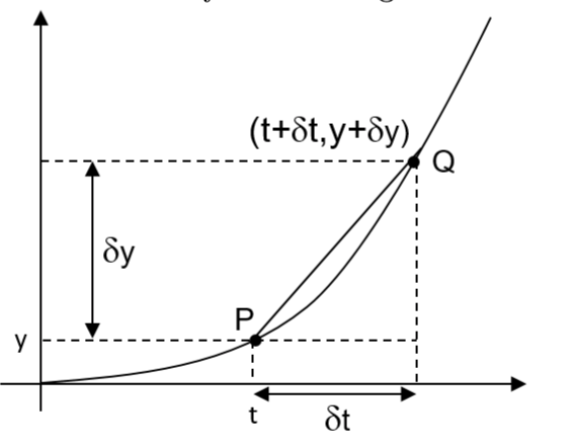
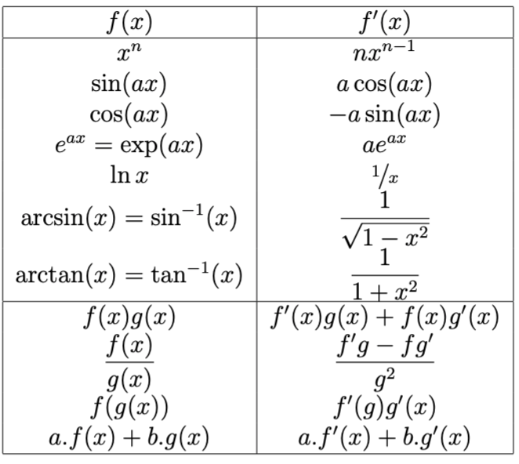
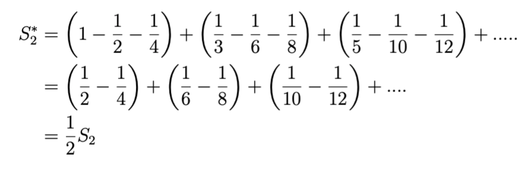
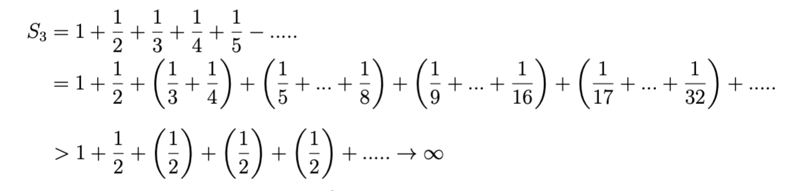
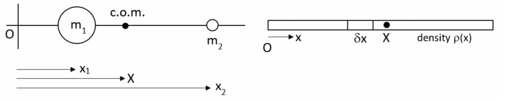

<!--
# VIV: The Principles & Applications of Calculus
## 1: Limits and Differentiation
### 1.1: Introduction to limits
* A limit is best regarded as the end point of the infinite process, or the target, so we **avoid the question of do we ever reach it**.
### 1.2: Differentiation from First Principles
#### 1.2.1: Average and exact gradient
* We need know the **precise** answer at **a point**.
* We choose two points close together, find the slope between them, then move them together.
* Then we find the tangent line by consider the limit of the 'close' process.
#### 1.2.2: Gradient of a curve - differentiation
* Example_1: 
    * If we consider the function $y=t^2$.
    * 
    * If we want to know the slope of the curve PQ, i.e. $\displaystyle\frac{\delta y}{\delta t}$
    * We can find that at point P,$y=t^2$ and at point Q $y+\delta y=(t+\delta x)^2$
    * Since $y=y$, we can find and rearrange it: $\displaystyle\frac{\delta y}{\delta t}=2t+\delta t$
    * When $\delta t\rightarrow 0$, we write: $\displaystyle\frac{dy}{dt}=\lim_{\delta t\to 0}\displaystyle\frac{\delta y}{\delta t}=2t$
    * We call this process **differentiation from first principles**, and its result is called **derivative**.
### 1.3: Notation
* Differentiation use various symbols: $d,\partial,D$ for derivatives, $\delta$ is used for  *infinitesimal* changes (tiny), and $\Delta$ for *finite* change (that don't tend to zero)
* We use these for derivatives: $\displaystyle\frac{dy}{dx},\displaystyle\frac{d}{dx}(y),f'(x),y'(x),\dot{y}$
* **Noted** that over-dot is only used for *time derivatives*.
* Partial differential are denoted: $\frac{\partial z}{\partial x},(\frac{\partial z}{\partial x})_y,z_x$
* Second derivatives use different symbols: $\displaystyle\frac{d}{dx}(\displaystyle\frac{d}{dx}(y))$, or $(\displaystyle\frac{d}{dx})^2y$ and $\displaystyle\frac{d^2y}{dx^2}$
* The 'double dot' and 'double prime' rules are same as that in first derivatives in second derivatives.
### 1.4: Standard Derivatives
* 
* Note that we use **binomial expansion** for the derivation of $y=x^n$.
### 1.5: Limits
#### 1.5.1: Convergent and Divergent series
* Such as $S_1=1/2+1/4+1/8+....\to 1$, we simply say $S_1=1$. If we consider is as a limit, this is a **convergent series**.
* Compared it with $S_2=1-1/2+1/3_1/4+....$, which has one '+' after one '-', it is called **convergent alternating series**.
* After re-arrange the series, we can find: 

* We call it **conditionally convergent**.
* A series that converges (*convergent*) even if all terms are made positive is called **absolutely convergent** which can be re-arrange to find the limit.
* However, the series labelled $S_3$ diverges, the prove can be:

* So $S_3\to \infty$ and is therefore divergent. This method of proof is called the **comparison test**.
* Noted that even though the individual terms in this series tend to zero, that does not prove convergence.
#### 1.5.2: Limits of functions
* 1: $\lim_{x\to 0}3x^2-4=-4$, whilst $\lim_{x\to \infty}3x^2-4=\infty$
* Note that the function is not simply getting close to the zero, but the difference between the function and zero is getting smaller.
* 2: $\lim_{x\to \infty}sin(x)=$'undefined', cause the sin(x) neither tends to a fixed value nor to infinity.
* 3: $\lim_{x\to 2}\displaystyle\frac{3}{x-2}\to \pm\infty$, or $\lim_{x\to 2+}\displaystyle\frac{3}{x-2}\to +\infty$ and $\lim_{x\to 2-}\displaystyle\frac{3}{x-2}\to - \infty$
* **Note that we use notation 2+ to mean 'from the positive side' and 2- for 'from the negative side'**.
* 5: $\lim_{x\to \infty}(\displaystyle\frac{x^2-1}{x+3})=\lim_{x\to \infty}[\displaystyle\frac{x^2(1-1/x^2)}{x(1+3/x)}]=\infty$
* In that case, the numerator and denominator both tend to infinity, we re-arrange and get the answer.
-->
## 2: Integration
### 2.1: The Definite Integration and Indefinite integration
* The integration that produces a value not merely a formula is called a **definite integration**.
* An integration without a value is called **indefinite integration**.
### 2.2: Relationship of integration to differentiation
* According to the fundamental theorem of calculus:
$\delta A\approx f(x)\delta x$, and $\displaystyle\frac{dA}{dx}=f(x)$ in the limit $\delta x\to 0$
* And the area is the **antiderivative** of the area, written as $A=\displaystyle\int{f(t)}dt$
### 2.3: Volume of Revolution
* A volume of revolution is formed by rotating a curve about a axis, which may be the x-axis or y-axis or other line.
* If the rotation is about the x-axis,each with radius given by $f(x)$ and thickness $\delta x$, the volume of one disc is $\delta V\approx \pi f(x)^2\delta x$
* And the volume between $x=a$ and $x=b$ is given by:
$\lim_{\delta x\to 0}\Sigma^{x=b}_{x=a}\pi f(x)^2\delta x$
* So $V=\displaystyle\int _a^b\pi y^2dx$
### 2.4: Arc-length
* To find the length of a curve expressed as $y=f(x)$.
* $\delta s^2\approx \delta x^2+\delta y^2$, so $\delta s\approx \sqrt{\delta x^2+\delta y^2}=\sqrt{1+(\displaystyle\frac{\delta y}{\delta x})}dx$
* Then we take a limit: 
$$
s=\lim_{\delta x\to 0}\sum\delta s=\lim_{\delta x\to 0}\sqrt{1+(\displaystyle\frac{\delta y}{\delta x})^2}\delta x=\int_a^b\sqrt{1+(\displaystyle\frac{dy}{dx})^2}dx
$$
### 2.5: Surface area or revolution
* The volume of revolution has a curved surface, which may be regarded as a sum of thin circular bands. 
* For each, the area is approximately the circumference multiplied by the length of the small piece of arc.
$$
A_S\approx\sum 2\pi y\delta s=\sum 2\pi y\sqrt{1+(\displaystyle\frac{\delta y}{\delta x})^2}\delta x=\int_a^b 2\pi y\sqrt{1+(\displaystyle\frac{dy}{dx})^2dx}
$$
### 2.6: Bending stiffness
* Initially, we will consider only a rectangular beam bending a small amount.Resistance to bending comes from stretching planes of material on the outside if the bend, and compressing in the inside bend, with: Resistance to bending $\pm$ amount of stretching $\times$ moment of about centre line.
* The strain (amount od stretch/compression) is proportional to the distance from the centre line, and the moment of that force is also proportional to the distance from the centre. Therefore we need to calculate the **second moment of area** about the centre line.
* For thickness $\delta y$ and width $w$, we get second moment $I$
$I\approx \sum (w\delta y)(y)(y)$,hence $I=\int_{-d/2}^{d/2}wy^2dy$.
* For rectangular beam of width $w$ and depth $d$, this gives $I=\displaystyle\frac{wd^3}{12}$.
* For a circular bar, it gives that $I=\pi r^4/4$, and hence for tube of inner radius $a$ and outer radius $b$, we get $I=\pi (b^4-a^4)/4$.
* Tubes and I beams have a large bending stiffness relative to their mass as much of the mass is away from the centre line (*neutral* *axis*).
## 3: Centre of Mass and Multiple Integrals
### 3.1: Centre of Mass in 1D 

* For two objects, we calculate the *centre of mass* by looking at total mass and the total moment.Take the moment about $O$, with $X$ as the coordinate of the c.o.m:
$$
m_1x_1+m_2x_2=(m_1+m_2)X,X=\displaystyle\frac{m_1x_1+m_2x_2}{m_1+m_2}=\displaystyle\frac{total moment}{total mass}
$$
* A collection of discrete objects but all on the same line:
$$
X=\displaystyle\frac{\sum m_ix_i}{m_i}
$$
* For a continuous bar in 1D, but with varying density $\rho(x)kg.m^{-1}$, we use the same starting with one small piece of the rod:
    * For the mass: $\delta m\approx\rho \delta x,m=\int_0^L\rho (x)dx$
    * For the moment about the $O$: $\delta M\approx \rho x\delta x,M=\int_0^L\rho(x)xdx$
    * Then the position of $X$ is given by the same ratio, $X=\displaystyle\frac{M}{m}$
### 3.2: Multiple integrals
* Integration in 2D or 3D uses the same concept - the limit of a sum of small contributions.**For example**, to find the mass of a rectangular plate with density $\rho=3+x+2y$, extending from $x=0\to 2$ and $y=0\to 3$

* For one small piece, $\delta m\approx \rho x\delta y$. For a strip parallel to the x-axis, mass $\approx[\sum \rho \delta x]\delta y$.
* Overall,$m\approx\sum [\sum \rho \delta x]\delta y$, and in the limit $\delta x\to 0$, $\delta y\to 0$.
* $m=\displaystyle\int_{y=0}^3[\displaystyle\int_{x=0}^2\rho(x,y)dx]dy=\int_0^3\int_0^2\rho(x,y)dxdy$
* Note that the inner integral has the end-points 0,2 and is treated as a function of $x$, with $y$ held constant, before complete the outer integral of $y$.(Order doesn't matter)
* To find the c.o.m with coordinates(X,Y), we need moments about two axes:
$M_X=\displaystyle\iint x\rho dxdy$ (About the y-axis), $M_Y=\displaystyle\iint y\rho dxdy$ (About the x-axis)
* Then $X=\displaystyle\frac{M_X}{m}$,$Y=\displaystyle\frac{M_Y}{m}$
* It is possible to adapt this approach to find the c.o.m, of non-rectangular regions.
* Other applications includes the case of a 2D or 3D body with internal heat sources or heat sinks. If there is equilibrium, then the heat crossing the boundary of the region must equal to the total heat source or sink within it.
* Thus we can equate the **volume integral** of heat produced with the **surface integral** of heat crossing a boundary.

