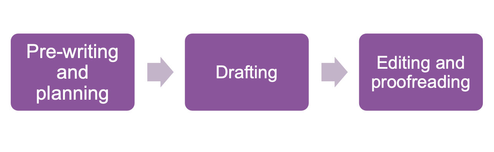

# I: Writing a Group Report

## 2: Time Management
* Less time spent planning = more time spent editing
* More time spent planning = less time spent editing
## 3: Grand  Planning: Benefits
* Planning the input controls he output
* Make drafting easier
* Editing process should become more manageable and streamlined
## 4: Pre-writing : The House Style
* Neutral, objective language (you can check the phrasebank.manchester.ac.uk)
* Avoiding contractions.
* Keeping an eye on sentence length (3 lines)
## 5: Drafting strategies
* Write in short, time burst if this makes it easier
* Leave notes to self to separate writing from editing
## 6: Editing: the three stages
### 6.1: Editing for structure
* Paragraphs
    * Topic sentence
    * This point is developed throughout a paragraph
* Transitions
    * Compare the last line of a paragraph with the first line of the next
    * Compare the sense of logical progression
* Relevance
    * Any repetitions
    * Need to versus nice to know for the reader
#### 6.2: Editing for criticality
* For every point you make, could the reader come back at you with a question?
* Reading aloud can help identify the inconsistencies in tone, long and unwieldy sentences and inaccurate vocabulary use.
