# III: Bipolar Junction Transistors
## 1: Basic operation 
* An NPN BJT is a semiconductor device consisting a narrow P-type region which called the **base**, while the two N-type regions called the emitter and the collector.
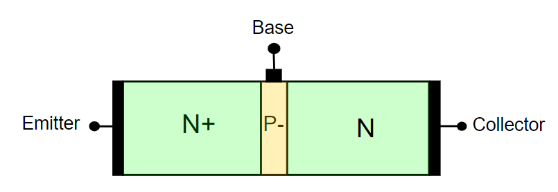
* The N-type emitter is **heavily** doped (N+), where the P-type is lightly doped (P-). The N-type collector has a **moderate** doping.
* This is not a symmetrical structure.
* The transistor is an active device and it is mainly used as amplifier or electronic switch.
* We can also build the *PNP bipolar junction transistor*.
## 2: Symbol of NPN BJT
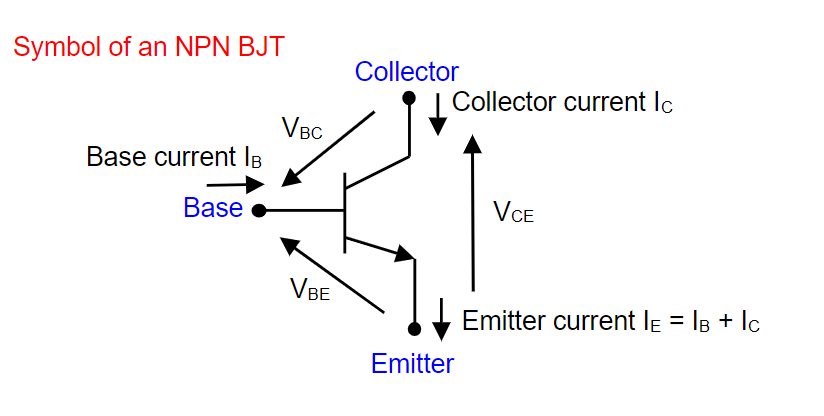
* In order to simplify the analysis, we assumed $V_{CE}$ is greater or equal to zero as we always connects the collector to $V_{CC}$ and connects the emitter to the ground.
* So the collector side have the high voltage and the emitter side have the low voltage side.
* As we always choose the as reference, $V_{CE}$ can be written as $V_{CE}=V_{CB}+V_{BE}=V_{BE}-V_{BC}$
## 3: Four mode of operation
### 3.1: Cut-off mode, when both BE and BC diodes are off
* As the base-collector junction and base-emitter junction have same threshold voltage, so we mark it as $V_{BE,on}$.
* For a silicon BJT, we have $V_{BE.on}$~ 0.7 volts.

* As the existence of the two depletion region, carriers from both sides cannot enter the base, 
$$
I_B=0, I_C=0, I_E=0
$$.
### 3.2: Forward-active mode, when the BE is on but BC is off
* The forward-active mode means $V_{BE}=V_{BE,on}$ and $V_{BC}<V_{BE,on}$.
* We can find that $V_{CE}>0$ in this condition.
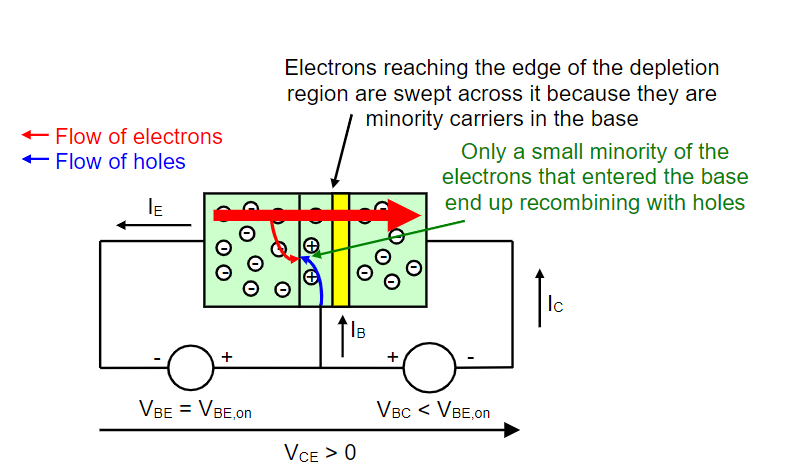
* As the electrons are minor carriers in base (lightly doped), only few electrons will combine with the holes in base.
* Most of the electrons from the emitters will across the base entering collector side.
* With the reverse-bias voltage, these electrons into the collector formed a collector current.
* Recalling the knowledge of the diode: **The depletion region cannot be crossed by majority carriers but the minority carriers.
* The plenty of electrons in BJT form the collector current.
* If we mark $\alpha _F$ as a constant parameter indicating the proportion of electrons coming form the emitters and reach the collector:
$$
I_C=\alpha _F I_E \\
I_B=(1-\alpha _F)I_E \\
$$
* We typically have $\alpha ~0.99$.
* From the previous equations, we can find that:
$$
I_C=\frac{\alpha _F}{1-\alpha _F}I_B
$$
* We notes $\beta _F=\frac{\alpha _F}{1-\alpha _F}$, which is called *forward current gain*.
* It shows the BJT can used as a linear current amplifier.
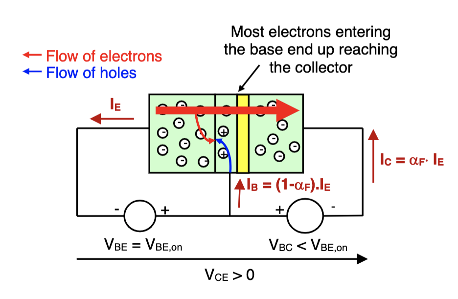
### 3.3: Reverse-active mode, when BE diode is off and BC is on
* If $V_{BE}<v_{BE,on}$ and $V_{BC}=V_{BE,on}$.
* If we take the emitter as a reference, since $V_{CE}=V_{BE}-V_{BC}$, we can get that $V_{CE}<0$.
* $V_{CE}<0$ is contradicted with the original assumption that $V_{CE}\geq 0$. So that BJT can never in this mode under this assumption.
### 3.4: Saturation mode, when both BE and BC diodes are on
* A BJT is said to be in saturation mode if $V_{BE}=V_{BE,on}$.
* $V_{BE}=V_{BE,on}$ and $V_{CE}=0$.
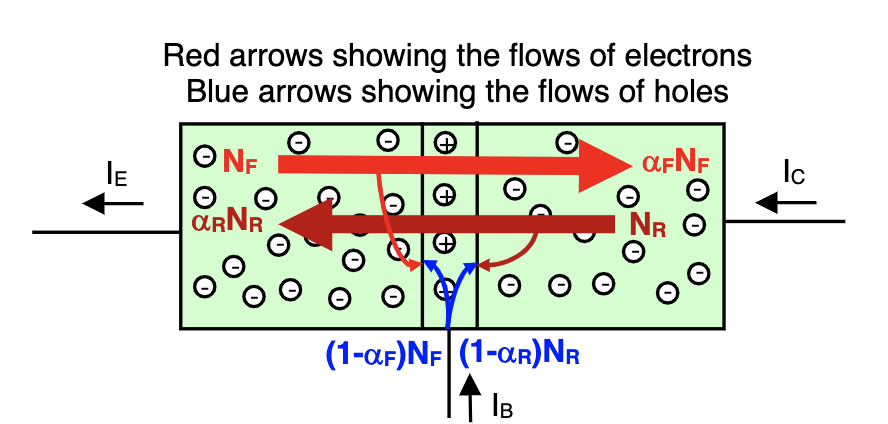
* There are two transistor effects to consider in this mode: a first one in forward direction and a second in the reverse mode.
* Note the forward effect is more powerful cause $\alpha _F ~0.99$ and $\alpha _R~0.5$.
* Since the concentration of free electrons is higher in the emitter than in collector, it is much easier to diffuse in forward direction.
### 3.5: Summary
* Strictly speaking, the forward-active mode is defined as the mode for which the current in reverse direction are negligible compared to the forward current.
* In practice, $V_{CE}$ is slightly greater than zero.
* So for the forward mode, the accurate statement should be "the BJT is forward active when $V_{BE}=V_{BE,on}$ and $V_{CE}>V_{CE,sat}$".
* Hereafter, we use $V_{CE,sat}=0.2$ volts.
* For the saturated mode, the statement should be "the BJT is saturated when $V_{BE}=V_{BE,on}$ and $V_{CE}=V_{CE,sat}$".
* For simplicity sake, we take $V_{CE}=V_{CE,sat}$ in saturation mode instead of $V_{CE}<V_{CE,sat}.$
## 4: Summary about BJT
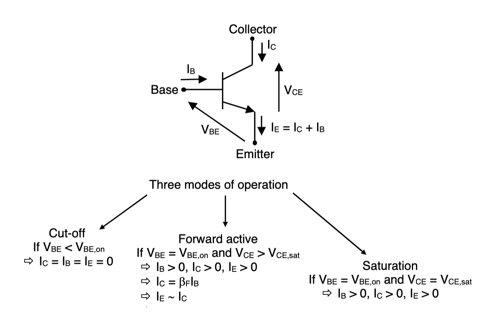
## 5: Application of BJT
### 5.1: Example_1 
* According to the KVL and Ohm's Law, we can get the expression below:
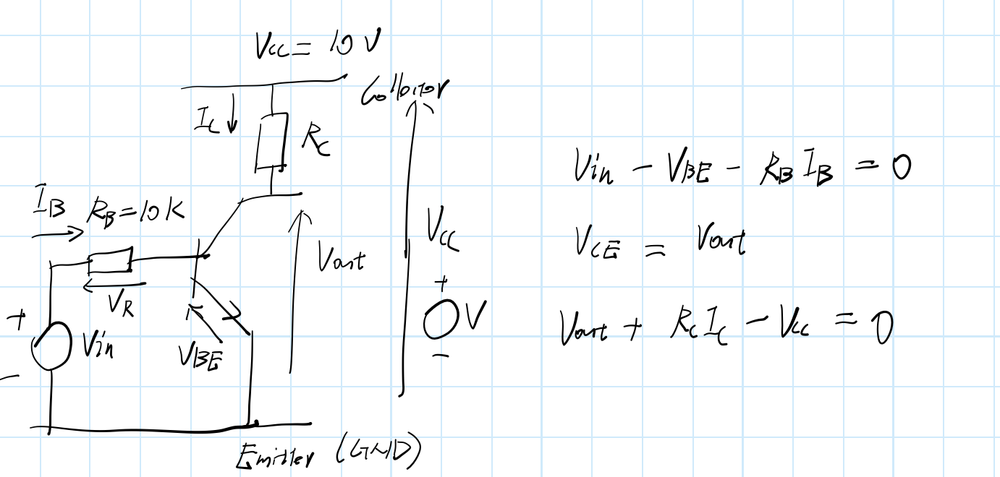
* If the BJT is in Cut-off mode:
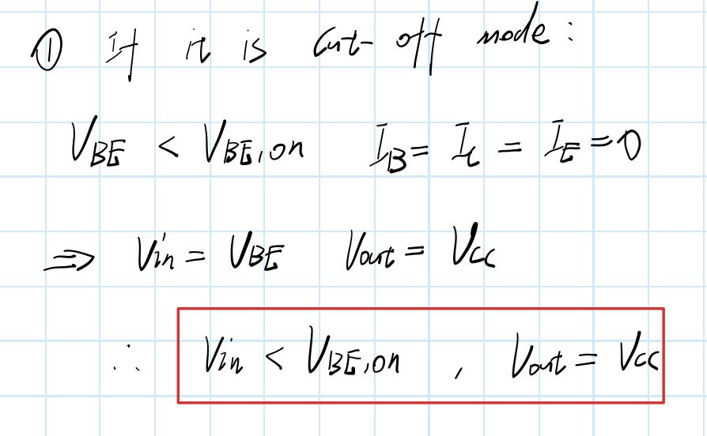
* Forward-active mode:
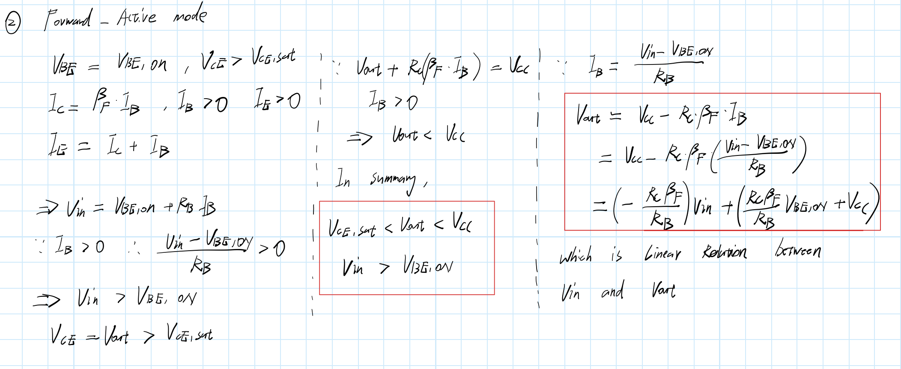
* Saturation mode:
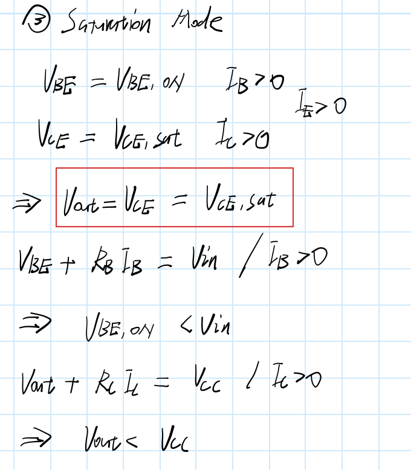
* Using the results above, we can get the curve below, which shows the function of $V_{in}$ and $V_{out}$:
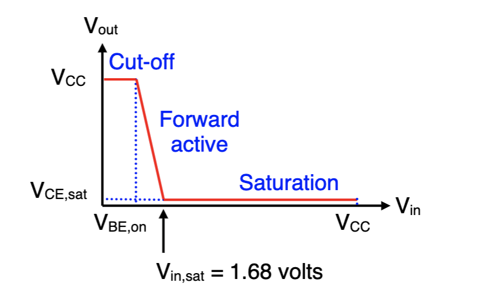
* This circuits can be used as an inverter (NOT gate) as it can invert the high volts to low and vice versa.
* The linear part of the graph can also be used as amplifier.
* As $V_{out}=V_{CC}=\beta _F \cdot \frac{R_C}{R_B}\cdot (V_{in}-V_{BE,on})$., we can defined the new input voltage as the increasing of the amount of $\Delta V_{in}$: $V_{in}'=V_{in}+\Delta V_{in}$.
* The new output voltage $V_{out}'$ due to $V_{in}'$ is given by:
$$
V_{out}'=V_{CC}-\beta _F \cdot\frac{R_c}{R_B}\cdot(V_{in}'-V_{BE,on})-\beta _F \cdot\frac{R_C}{R_B}\cdot\Delta V_{in}
$$
* So that we can find the increment:
$$
\Delta V_{out}=-\beta _F\cdot\frac{R_C}{R_B}\cdot\Delta V_{in}.
$$
* This is the behaviour of a linear voltage amplifier with a voltage gain:
$$
\frac{\Delta V_{out}}{\Delta V_{in}}=-\beta _F\cdot\frac{R_C}{R_B}
$$
* Top make our circuit work as a practical linear amplifier, we have to make sure the BJT always in forward-active mode.
### 5.2: Example_2
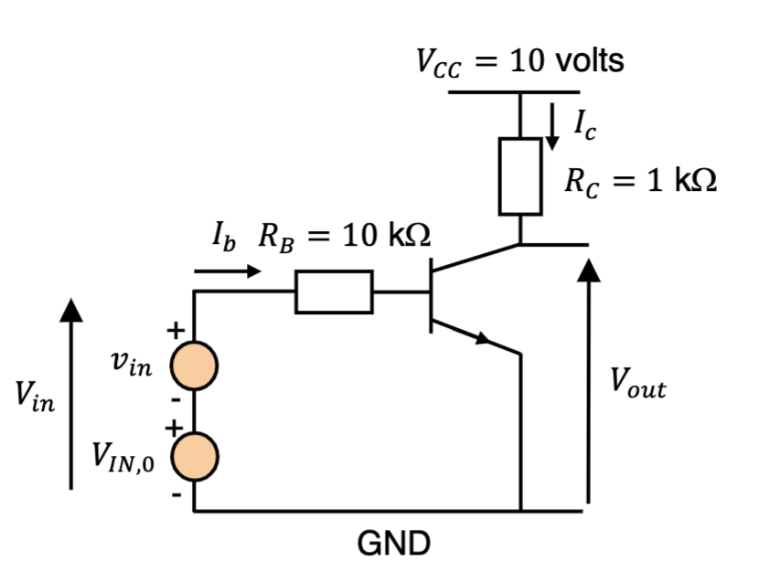
* What we are going to do is add another DC voltage source $V_{IN,0}$ and AC source $v_{in}$ to compose the $V_{in}$:
$$
V_{in}=V_{IN,0}+v_{in}
$$
* The DC voltage source $V_{IN,0}$ is used to bias the circuit so that forward-active mode can remain, so the $V_{IN,0} often referred as the **bias voltage**.

* If we replace $V_{in}$ by $V_{in}=V_{ON,0}+v_{in}$:
$$
\begin{align*}
V_{out} &=V_{CC}-\beta _F\cdot
\frac{R_C}{R_B}\cdot(V_{IN,0}-V_{BE,on})-\beta _F \cdot\frac{R_C}{R_B}\cdot v_{in}   \\
&=V_{OUT,0}+v_{out} \\
\end{align*}
$$
* $V_{out,0}$ is the DC components of the output.
* $v_{out}$ is the AC signal.
* The '0' means the AC signal swings around zero as mean value:
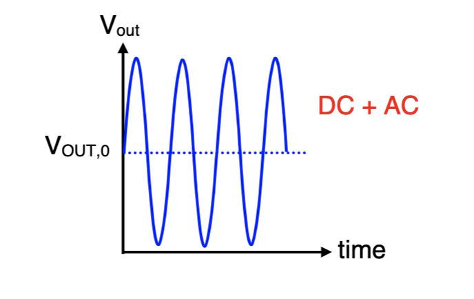
* The DC voltage $V_{IN,0}$ and $V_{OUT,0}$ are the *bias voltages*.
* To design the value of bias voltages, we need know the **maximum output voltage swing, $\Delta V_{out,max}$**, which is the maximum peak-to-peak amplitude of the AC output voltages $v_{out}$ that make sure no distortion. The same for $v_{in}$.
* We can see the effective voltage swing from the graph below:
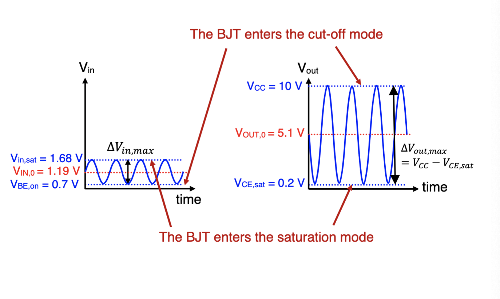
* In this circuit, in order to maximum the maximum output voltage swing, we have to ensure that $V_{OUT,0}$ is located at the midway of the $V_{CC}$ and $V_{CE,sat}$:
$$
V_{OUT,0}=\frac{V_{CC}+V_{CE,sat}}{2}
$$
* Same for the $V_{IN,0}$.
* The final result will be:
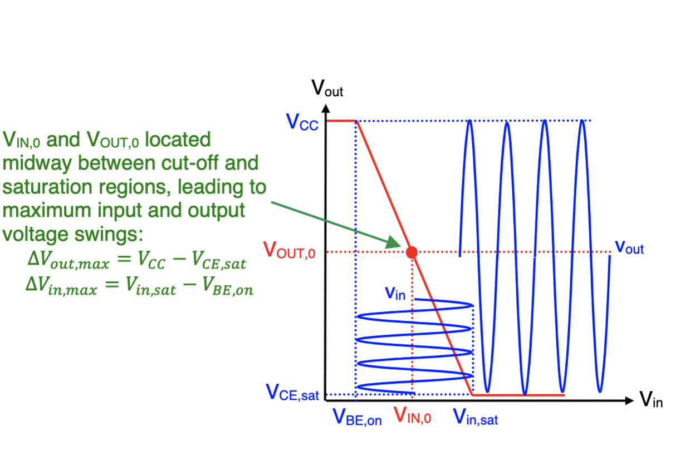
* For the bad choose of bias voltages, distortion (clipping) will occur:
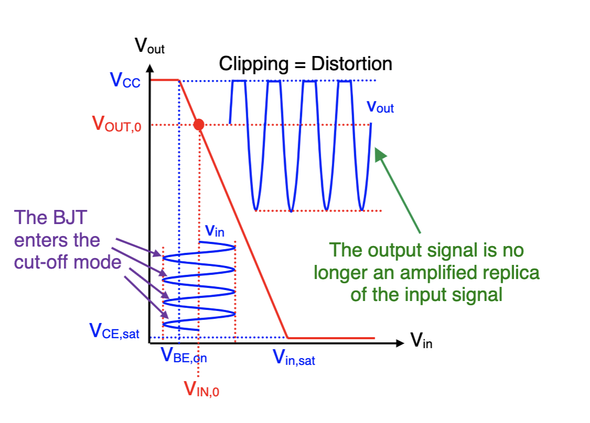