# I: Digital Processing and Binary Arithmetic
## 1: Digital Processing
### 1.1: Analogue and Digital Signal
* 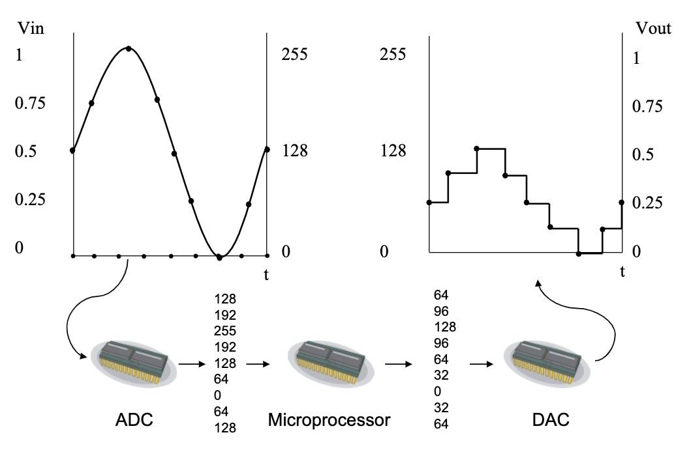
* The microprocessor can convert the **Analogue Signal** to **Digital Signal**.
#### 1.1.1: The Analogue Signal
* **Analogue signal** means the signal which can form **continuous function** of **time**.
* The voltage, current,displacement and such physical quantities are **Analogue Signal**.
#### 1.1.2: The Digital Signal
* It is the digital from of a sequence of of **discrete** values.
* **Discrete** means not continuous, which only have values at samples.
* In most digital circuits, the signal only have two values which is called $binary signal$ or $logic signal$.
### 1.2: The construction of processor
* 
## 2: Binary Arithmetic
### 2.1: Binary Addition 
* $1+1=10$
* $1+1+1=11$
### 2.2: Binary-Decimal Conversion
* Binary to Decimal:
    * 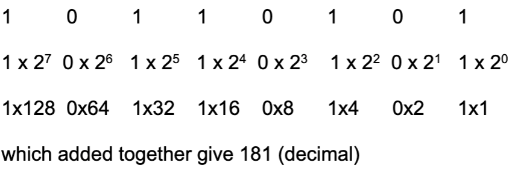
* Decimal to Binary:
    * Use the short-division.
    * -
    * -
## 3: Hexadecimal Arithmetic
### 3.1: The reason why we use Hexadecimal
* The expression of binary numbers is too long to use.
* 4 digits of Binary = 1 digit of Hexadecimal
### 3.2: Binary-Hexadecimal conversion
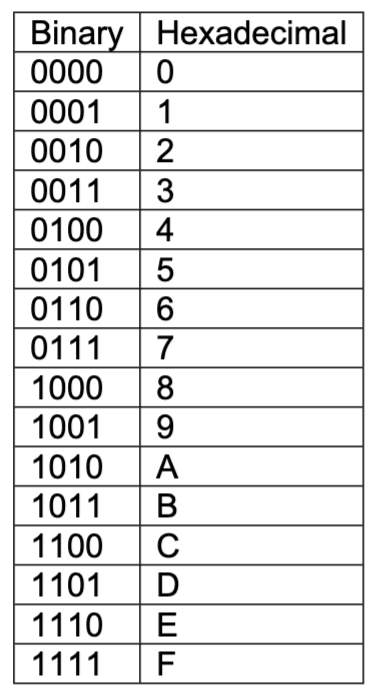
## 4: Negative numbers and Subtraction
### 4.1: The Expression of Subtraction
* It is difficult to do the subtraction, so we use the way of **complementing** to do the subtraction and minus number.
* For the binary, we use the **2's complement arithmetic**.
* The substation **a-b** can be expressed as **a+(the complement of b)+1**.
* For the example of decimal, such as $215-145$, we can use the compliment of $145$, which is $999-145+1=855$ (No carried number). Then the result will be $215+855=1070$, then if we **omit the carry**, it will be $070$.
* For the example of binary, we can simply **invert** the number then **plus 1**, and we should **ignore the carry out of the highest digit**.
* Such as $01101100-00101101$, we can first change $00101101$ to $11010011$. Then the result will be $01101100+11010011=001111111$, which ignore the carry out of the highest digit.
### 4.2: The way processing minus numbers in computers
* In computer, we use the **2's complement** to express a number 's minus value.
* The minus number will be marked as **signed number** while the positive number will be **unsigned**.
* For example, in binary, if the number is marked as unsigned, $10010001$ will means $145$.
* However, if the value is marked as signed, $10010001$ will means $-111$.
# II: Combinational Logic: Introduction
## 1: The Boolean Operation: AND
* If we A+B in binary and 'C' means carry out, 'S' means sum in the digit.
* 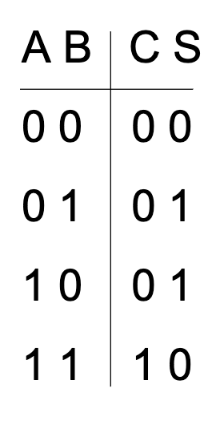
* From the 'C' result of the binary truth table, if '0' means 'false' and '1' means 'true', we can define the operator **'AND'**.
* **AND** can be expressed as $C=A.B$.
* Only if both input A and B are '1', the output C = 1.
* 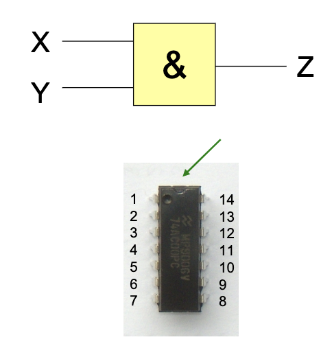
* Logic 1 can also means VCC and logic 0 means 0 V (the ground).
## 2: The Boolean Operation: OR
* The operation **OR** is expressed as Z=X+Y, if there is one or two '1' in the input, the input will be '1'.
* 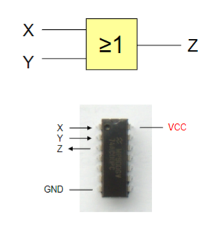
## 3: The Boolean Operation: NOT
* It can invert the input '1' to '0' and '0' to '1'.
* 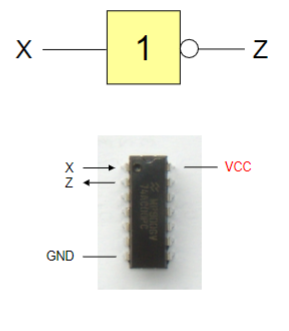
## 4: The Boolean Operation: OR-EXCLUSIVE
* Only if the input is '1' and '0', not all '1', then the output will be '1'.
* 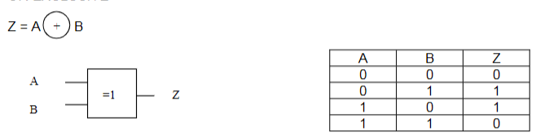
* This operator can give the one-digit sum of the input.
* The only difference between EXCLUSIVE-OR and AND is the '1' '1' condition.
## 5: The Boolean Operation: NAND
* 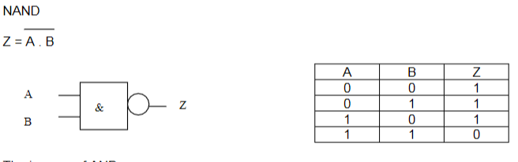
* It is the invert of the AND.
## 6: The Boolean Operation: NOR
* 
* The inverse of OR.
* Only one of the input is '1' then the output will be '0'.
## 7: The half adder and full adder
### 7.1: The Half adder
* The half adder use EX-OR to produce sum and another AND to produce the carry out.
* 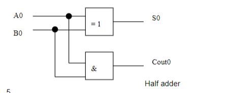
### 7.2: The Full adder
* In addition of the half adder, the full adder can accept the carry out from the previous digit.
* The EX-OR can be used to process the sum in one digit.
* Three AND gates are used to justify whether there is a **carry out** during the calculation.
* The final OR gates can be used to analysis the result of the AND gates. IF one of them is '1', it will produce a '1' as the carry out to $C_{out}1$.
* 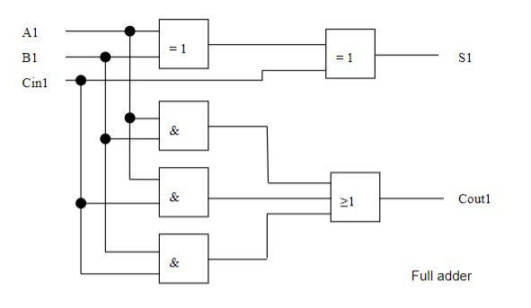
# III: Combinational Boolean Algebra
## 1: The way to simplify the gates
* Truth tables can be used to simplify the gates.
* The second method to simplify is to write the **Boolean Expression**. Such as $Z=XY+\bar{W}$
## 2: The Boolean Algebra
### 2.1: Distribution Theorem
* $A.(B+C)=A.B+A.C$
* $A+(B.C)=(A+B).(A+C)$
### 2.2: Complement Theorem
* $A+\bar{A}=1$
* $A.\bar{A}=0$
### 2.3: Redundancy Theorem
* $A.B+A=A$
* $A.(A+B)=A$
### 2.4: De Morgan's Law
* $\bar{A+B}=\bar{A}.\bar{B}$
* $\bar{A.B}=\bar{A}+\bar{B}$
* It is noted that the operation $\bar{A+B}$ means the invert of both **A,B** and **the OR operation**.
* For example, the expression $X=\bar{(C.D)+E}$, can be simplified to $X=\bar{(C.D)}.\bar{E}$, then will be $X=(\bar{C}+\bar{D}).\bar{E}$
### 2.5: Commutation Law
* $A+B=B+A$
* $A.B=B.A$
### 2.6: Association Law
* $(A+B)+C=A+B+C=A+B+C$
* $(A.B).C=A.(B.C)=A.B.C$
* **Noted** that it does not apply when a expression contain  both AND and OR, such as $(A.B)+C\not ={A.(B+C)}$
### 2.7: Idempotency Law
* $A+A=A$
* $A.A=A$
* Idempotency means the multiple manipulations have same effect as the first manipulation.

