<!--
# IV: Sequential Logic: Introduction
## 1: The Application of the NAND gates
* The truth table of NAND gates:
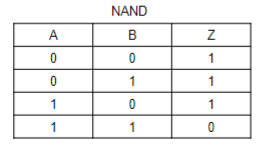
## 2: Set-reset *flip-flop*

* Apart from the combinational logic we learnt before, which means the output is a function of input. The **Sequential Logic** means that the output is not only depends on the input but also the **previous state**.
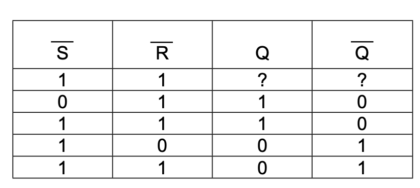
* From the truth table we can see, the '1''1' is unknown at first, but it will **remain** the previous state of '1''0' or '0''1'.
* This circuit is also called R-S Flip-flop, where the R stand for 'Reset' and S for 'Set'.
* It can be drawn as a single symbol without the internal detail:
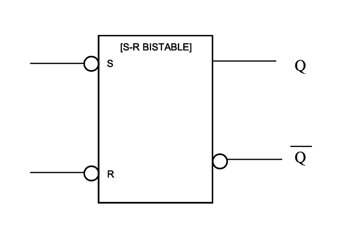
## 3: D-type flip-flop
* The most important type of flip-flop is known as *edge-triggered D flip-flop*, which can also be used as a R-S flip-flop. What's more, it has a **data input**, labelled D, and a **controlled input**, C.
* The output changes to **follow the input D** at the *instant* the control rises from 0 to 1. i.e. on the edge of the control. At other time, it will follow the previous state.
* The sideways 'V' means the control denotes that it triggered by a rising edge.
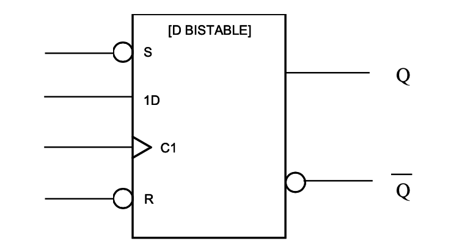
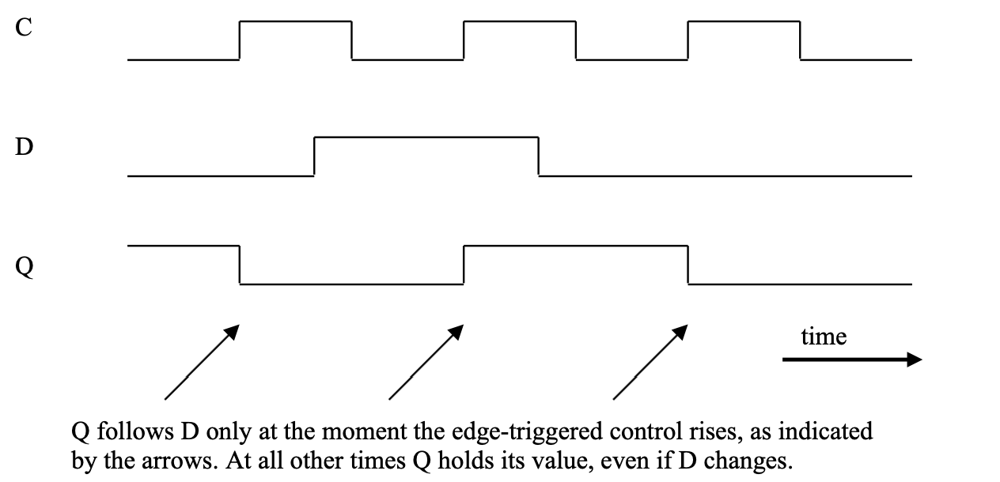
### 3.1: Example_1: Finite state machine
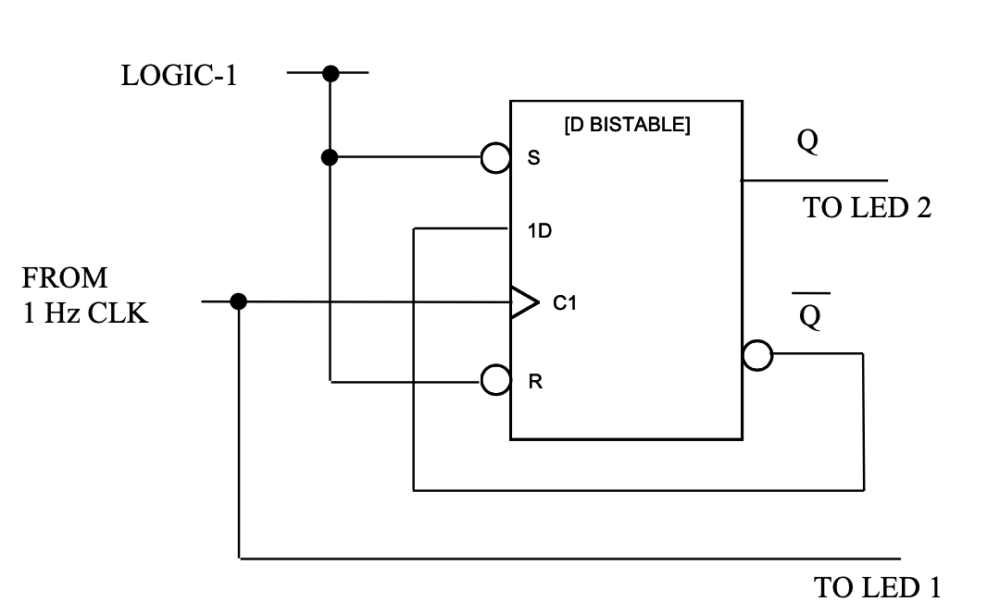
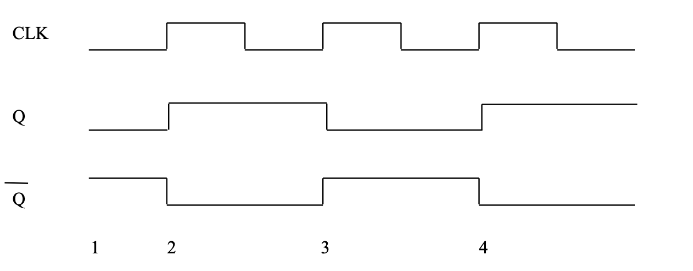
* If the original state of $Q$ and $\bar{Q}$ is '0' '1', we can find that the frequency of LED 2 is 1/2 Hz/s and LED 1 is 1 Hz/s.
* This is a simple *finite state machine*.
-->
# V: Sequential Logic: State Machines
## 1: The State Machines
* Suppose that your are asked to designed a system that lights a pair of LEDs in the following sequence, which your will recognize as a two-bit binary counter.
* The system advances from one state to the next at every clock edge.
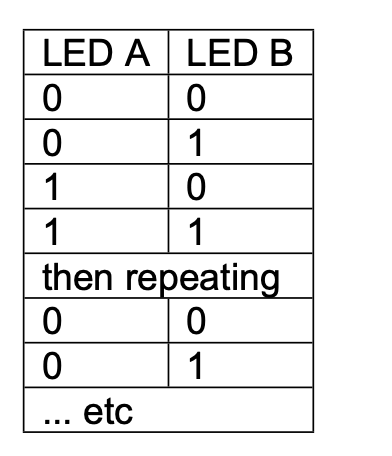
* The fundamental shape of this system is the state machine. Two D-type flip-flop can store the state of the outputs, and a function of these outputs is fed back to the input, to form the new outputs after the next clock edge.
* We use the following way to deduce what the function is: 
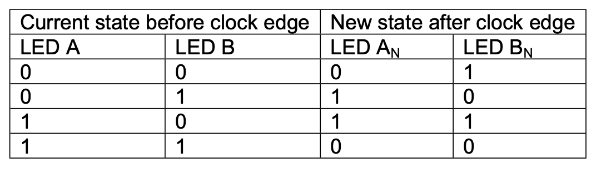
* From this, we can find that $B_N=\bar{B}$ and $A_N=A\oplus B$
* Then we can build the circuit:
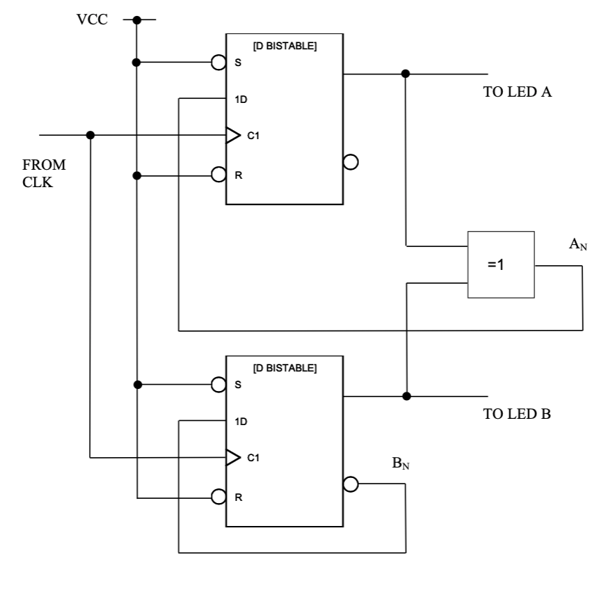
## 2: Example_1
* Design a two-bit counter which omit "0", (3,2,1,3,2,1...)
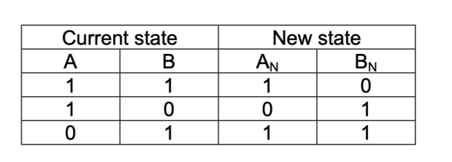
* The we find that $A_N=B$ and $B_N=\overline{A.B}$
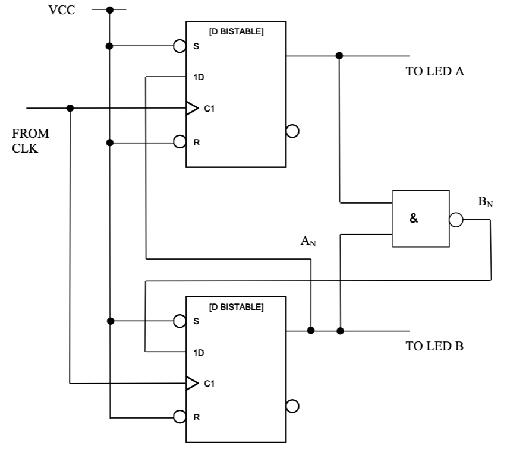
* Noted that we use the NAND gate instead of OR-EXCLUSIVE gate, cause when A and B are both logic '0', it will advance to A=0 and B=1 next clock edge, then will be correct. However if it is OR-EXCLUSIVE gate, it will remain '0' '0' forever.
## 3: Example_2
* Design a system that generates 3,2,1,0,3,2,1,0
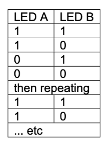
* No OR-EXCLUSIVE
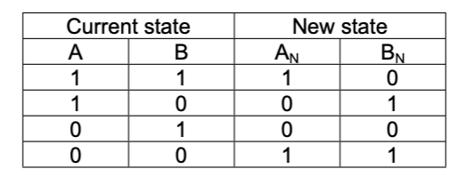
* We can find that $A_N=\bar{A}.\bar{B}+A.B$ and $B_N=\bar{B}$
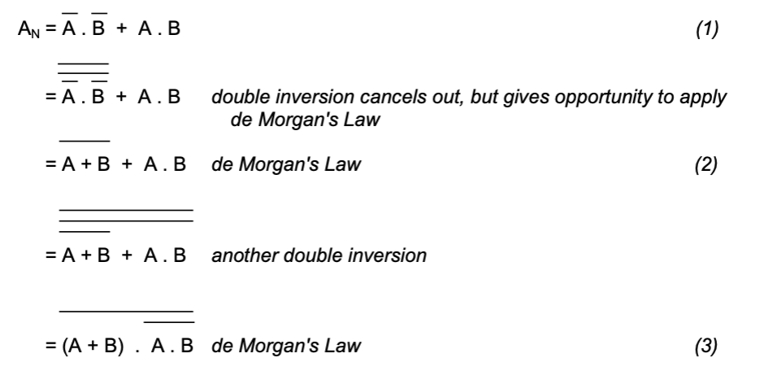
* We use the last one cause it have less gates and types of functions.
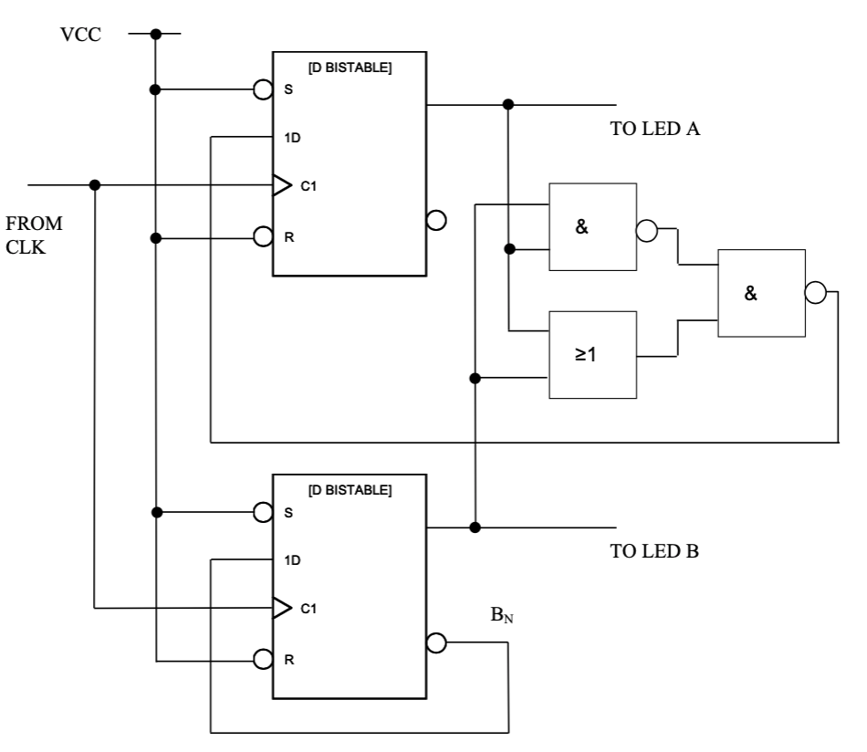