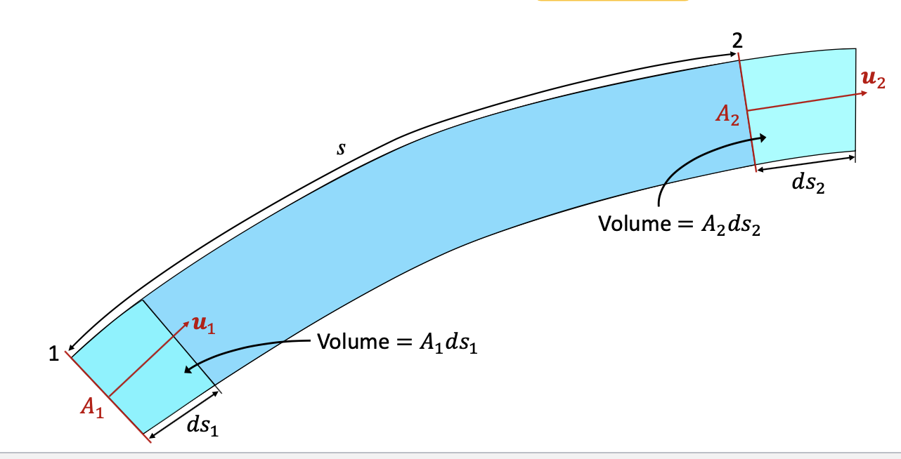
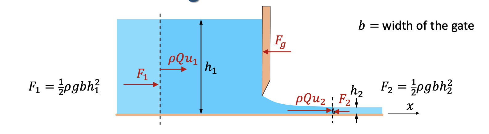
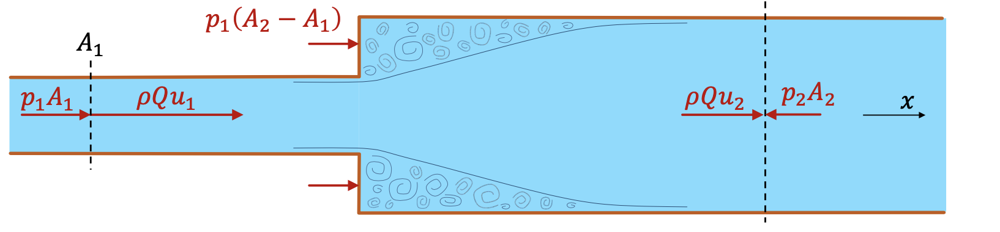

# X: Conservation of Momentum
## 1: Definition
* Momentum, $M=mv$
* Newton's second law of motion: $\Sigma F=\displaystyle\frac{dM}{dt}$
* Impulse-momentum equation: $\Sigma Fdt=dM$
## 2: Impulse-momentum equation of Control Volume
* $dM=\rho A_2ds_2u_2-\rho A_1ds_1u_1$ 
* $\Sigma Fdt=dM=\rho A_2ds_2u_2-\rho A_1ds_1u_1$
* For $ds$ can be expressed as $udt$ and $Q=Au=constant$, the equation can be simplified as :
$$
\Sigma \vec{F}=\rho Q(\vec{u_2}-\vec{u_1})
$$
* What's more, we can get this equation in 3D:
$$
\Sigma F_x=\rho Q(u_{2x}-u_{1x})
$$
$$
\Sigma F_y=\rho Q(u_{2y}-u_{1y})
$$
$$
\Sigma F_z=\rho Q(u_{2z}-u_{1z})
$$
## 3: Bousinesque coefficient
* The Bousinesque coefficient:
$$
\beta=\displaystyle\frac{1}{A}\int_A(u/\bar{u})^2dA
$$
* With the coefficient, we can find: 
$$
\Sigma \vec{F}=\rho Q\beta(\vec{u_2}-\vec{u_1})
$$
## 4: Application of Conservation of Momentum
### 4.1: Force in a Sluice Gate
* The sluice gate: 
 
* According to the Conservation of Momentum, $\rho Qu_1+\Sigma F=\rho Qu_2$ in x-direction.
* It can be found that $\Sigma F=F_1-F_2-F_g$, where the $F_1$ and $F_2$ are Hydraulic thrust of the beginning and end of the Control Volume and $F_g$ is the Compressive force of the wall.
* So if $b$ is the width of the sluice gate, we can simplify it by:
$$
\rho gQu_1+\displaystyle\frac{1}{2}\rho gbh_1^2-F_g-\displaystyle\frac{1}{2}\rho gh_2^2=\rho Qu_2
$$
### 4.2: Sudden expansion
* The sudden expansion:

* $\rho Qu_1+\Sigma F=\rho Qu_2$
* $\rho Qu_1+p_1A_1+p_1(A_2-A_1)-p_2A_2=\rho Qu_2$
* $z_1+\displaystyle\frac{p_1}{\rho g}+\displaystyle\frac{u_1^2}{2g}=z_1+\displaystyle\frac{p_2}{\rho g}+\displaystyle\frac{u_2^2}{2g}+losses$
* $losses=\displaystyle\frac{(u_1-u_2)^2}{2g}$