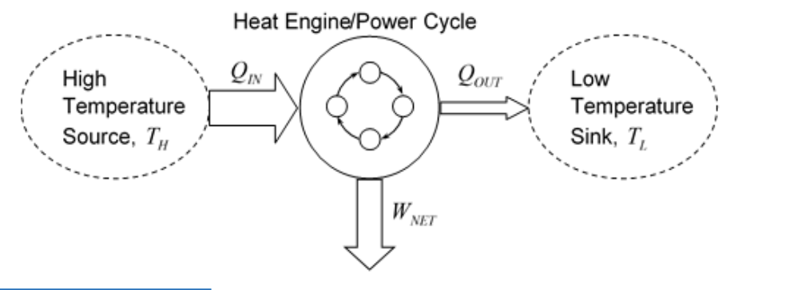
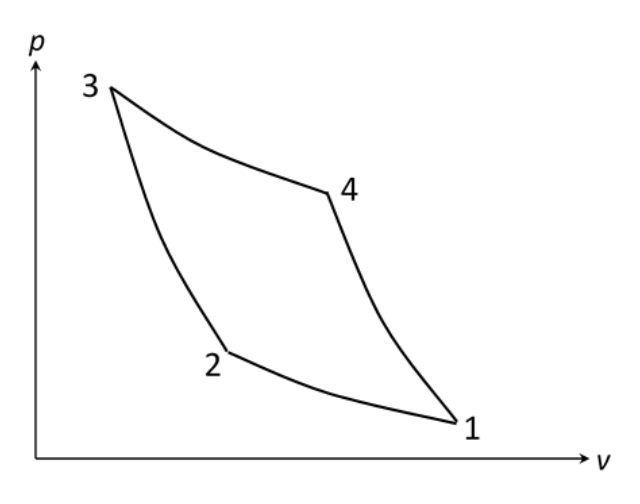
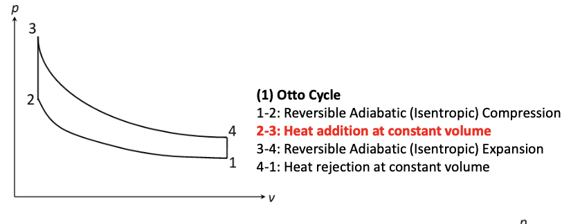
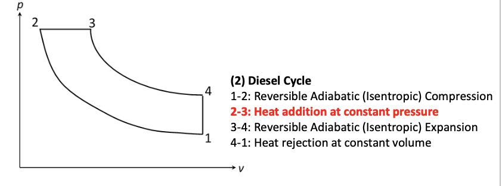
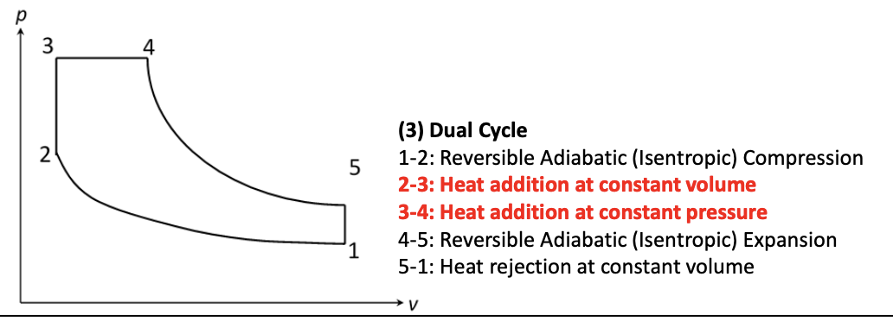
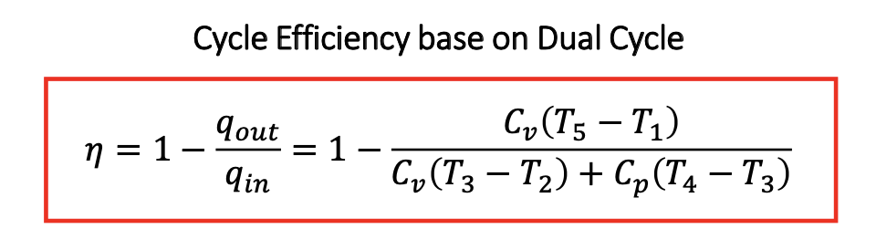

<!--
# XV: Standard Cycles
## 1: Introduction 
### 1.1: What are thermodynamic cycles
* A series of thermodynamic processes
* Arranged sequentially to from a cycle.
* The working fluid undergoes a series of changes in state and is returned to the initial conditions at the end of the cycles.
* Usually idealised.
* Cycles are arranged in specific configuration to achieve particular purposes:
    * Converting Heat to Work.
    * Move heat energy form low to high temperature regions (**refrigeration**)
    * Work done to sore potential or pressure energy. (compressing gases)
### 1.2: What are standard cycles
* Standard cycles:
    * Generally agreed cycle configurations.
    * Generally accepted as applicable to specific tasks and machines.
    * Often named after particular individuals to honour their contribution.
* What are standard cycles used for:
    * Provide the idealised basis of thermodynamic machines.
    * Theoretical limits / feasibility.
    * Provide guidelines & a basis of calculation of cycle operating conditions
### 1.3: Thermodynamic Machines and Machine Cycles versus Theoretical (Standard) Thermodynamic Cycles
* **Thermodynamic Machines**: are the physical and practical hardware operating in machine cycles.
* **Machine Cycles**: Are a repeating sequence of events subjects to all applicable laws of physics.
* **Theoretical Thermodynamics Cycles**: are idealised and conceptual and make no attampt to model much of the detail indicate of actual mechanical devices.
### 2: General approach to performing analysis 
* Applied to systems modelled as:
    *  **Closed systems (reciprocating internal combustion engines)**: Energy exchangedd calculated with Non-Flow Energy Equation (NFEE).
    * **Open systems (gas turbines)**: 
        * Generally assumed to be operating in a steady state.
        * Energy Exchanges calculated with Steady Flow Energy Equation (SFEE)
        * Only enthalpy changes need to be considered.
* Basic metrics of cycle performance:
    * **Ratio of relevant energy exchanges involved** 
        * Efficiency (heat engine cycles)
        * Coefficient of performance (refrigeration cycles)
    * **Mass (Mass flow rate) of working fluid required to achieve particular energy exchanges** 
        * This can be useful as a proxy for system size or weight.
        * Power-to-weight ratio.
        * Power-to -volume ratio.
        * Indicated mean effective pressure.
        * The more working fluid mass, or mass flow rate per unit output ,then generally the larger the system will be required.
* Circle Efficiency Calculations:

* First Law:
$$
W_{NET}=Q_{IN}-Q_{OUT}
$$
* Efficiency: 
$$
\begin{align*}
\eta &=\frac{W_{NET}}{Q_{IN}} \\
&=1-\frac{Q_{OUT}}{Q_{IN}} \\
\end{align*}
$$
## 2: Standard Cycles: The Carnot Cycles

* Carnot's work is recognized as laying the foundations of thermodynamics.
* 1-2: Isothermal (Low Temperature, $T_L$)
* 2-3: Reversible Adiabatic Compression 
* 3-4: Isothermal Heat Addition (High Temperature, $T_H$)
* 4-1: Reversible Adiabatic Expansion
* Carnot demonstrated that the max efficiency is between $T_H$ and $T_L$:
$$
\eta_{Carnot}=1-\displaystyle\frac{T_L}{T_H}
$$
* This also leads to the idea which means the larger the value of $T_H$, the higher the cycle efficiency in his cycle.
## 3: Standard Cycles: Otto - Diesel - Dual 
### 3.1: Otto Cycles
* Spark ignition reciprocating engine (the basis of Petrol Engine or Gas Engine)

### 3.2: Diesel Cycles
* Compression ignition reciprocating engine.

### 3.3: Dual Cycles
* To more accurately model real internal combustion engine operation than constant volume heat and constant pressure heat.

## 4: Standard Cycles analysis
* Treated as a closed system and NFEE can be used for the basis .
* Assume as perfect gas with constant specific heat capacities 
* **Definition**: (volumetric) Compression Ratio, $r_v$
$$
r_v=\frac{v_1}{v_2}=\frac{V_1}{V_2}
$$
* i.e. ratio of maximum to minimum volume

* For Otto or Diesel just omit the relevant heat addition.
-->
