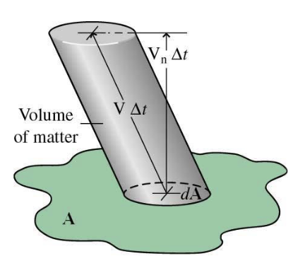
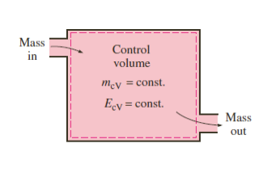
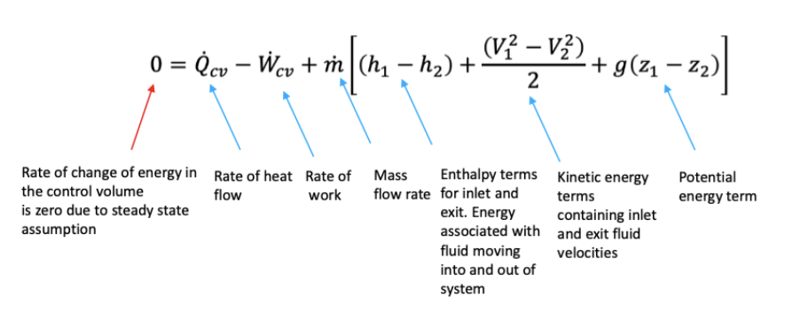
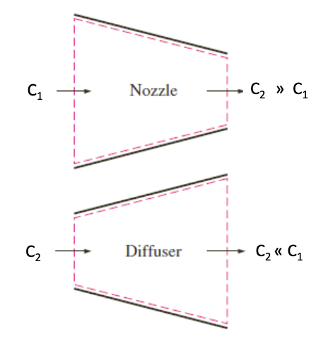
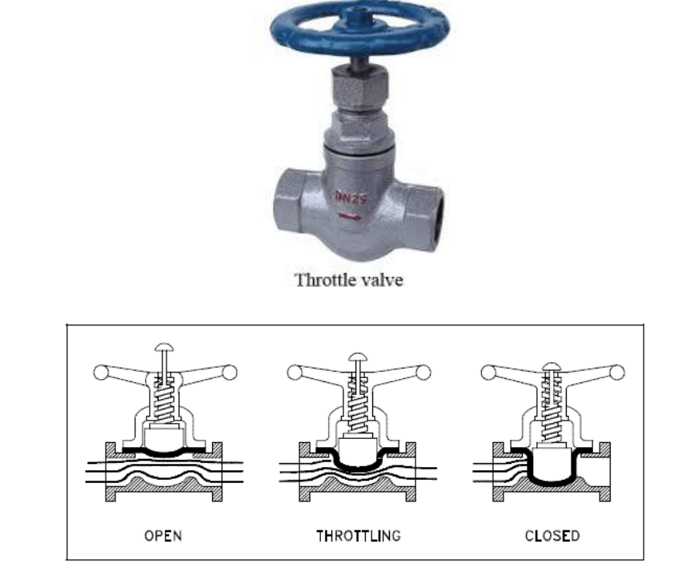
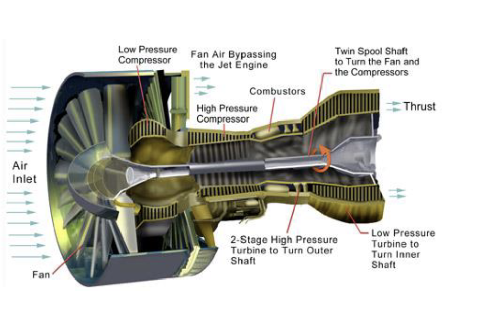
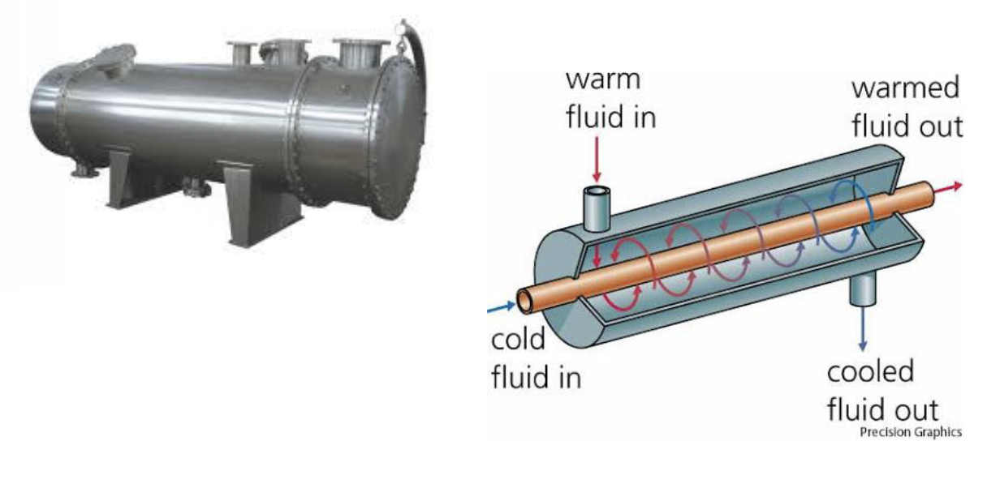

<!--
# XV: Steady Flow Energy Equation
## 1: Mass Flow Rate
* We need a methodology which could combine mass and energy balance our control volume.
* Amount of mass crossing dA during = $\rho (V_n\Delta t)dA$, where the $V_n$ means the velocity and $\Delta t$ for the time.
* 
* The we can find the mass flow rate: $\dot{m}=\displaystyle\int_A{\rho V_n dA}$
## 2: Conservation of mass principle
* $\Delta m_{CV}=m_{in}-m_{out}$ or $\dot{m}=\dot{m}_{CV}-\dot{m}_{out}$
## 3: Steady state processes
* The fluid properties can change from point to point within control volume.
* Remain the same at any points.
* The volume,mass and total energy are same in the process.
* 
## 4: Forms of mass rate balance
* For 1-D flow: $\dot{m}=\rho AV$
* In terms of specific volume v: $\dot{m}=AV/v$, where the $v$ means volume per mass.
* Under steady state conditions (meaning that all the properties don't change with time), we have:
$\dot{m}_{in}=\dot{m}_{out}$
* Finally, we can find $\dot{m}_{CV}=0$
## 5: Conservation of energy
* For a system with just a single exit and a single entrance and under steady state conditions:

* This is the SFEE and it allows to calculate the power, rate of heat transfer, fluid velocity.
* These includes nozzles, compressors, boilers, turbines and heat exchangers to name a few.
# XVI: Nozzles,diffusers and throttles
## 1: Typical elements and devices
* Typical devices that we model with SFEE includes:
    * Nozzles
    * Diffusers
    * Throttling valves
    * Turbines
    * Compressors
    * Heat Exchangers
## 2: Nozzles and diffusers
### 2.1: Introduction
* A **nozzle** is a device that increase the velocity of a fluid at the expense of pressure.
* A **diffuser** is a device that increase the pressure of a fluid by slowing it down.

### 2.2: Characteristics
* The heat transfer between the fluid flowing between the nozzle or diffuser and the surrounding is often negligible.($\dot{Q}=0$)
* Nozzles and diffusers typically involve **no external work**($\dot{W}_{ext}=0$) and any change in **potential energy is negligible** ($\Delta PE\approx 0$)
* Nozzles and diffusers usually involve very high velocities.
* As a fluid passes through a nozzle or diffuser, it undergoes **large changes in its velocities**.
* The kinetic energy change must be accounted for in analyzing the flow.
## 3 : Throttling valves
### 3.1: Introduction

* The throttling valves can cause a large drop in **pressure and temperature**.
* Commonly used in refrigeration and air conditioning applications.
### 3.2: Characteristics
* The Throttling valves are usually small devices so the flow we may treat as **adiabatic** (Q=0).
* No external work(**$W_{ext}=0$), and the change in potential energy is really small($\Delta PE\approx 0$)
* The exit velocity is often higher than the inlet, but the change in kinetic energy is small ($\Delta KE\approx 0$)
* The enthalpy is roughly constant ($h_2\approx h_1$), "isenthalpic".
* There is a exchange between internal and flow energies:
$u_2+p_2v_2=u_1+p_1v_1$
-->
## 4: Turbines and Compressors
### 4.1: Turbines

* **Turbines** are devices that drive an electric generator, and can be found in steam, gas, or hydroelectric (by water) power plants.
* As the fluids passes through the turbine, work is done against the blades, which are attached to the shaft.
* The shaft rotates, and the turbine produces work.
### 4.2: Compressors
* **Compressors**, as well as pumps and fans, are devices used to increase the pressure of a fluid.
* Work is supplied to these devices from an external source through a rotating shaft.
* Therefore, compressors involve work input.
### 4.3: Characteristic
* Fans increase the pressure of a gas slightly and is mainly used to mobilize a gas.
* Compressors are capable of compressing the gas to very high pressures.
* Pumps work very much like compressors except that they handle liquids instead of gases.
* Note that **turbines produce power and others require power input**.
* Heat transfer from turbines and compressors is usually negligible ($\dot{Q}=0$) since they are typically well insulated.
* Potential energy change are negligible ($\Delta PE=0$).
* Velocities are usually too low to cause any significant change in the kinetic energy. ($\Delta KE=0$)
    * Noted that for turbines and fans, the velocities encountered can be high, but he change is usually small so that can be disregarded.
## 5: Heat Exchangers

* Heat exchangers are devices where two moving fluids streams exchange heat without mixing.
* Heat exchangers are widely used in various industries.
* Heat Exchangers typically involve no work interactions ($W_{ext}=0$) and negligible kinetic and potential energy changes ($\Delta KE=0$ and $\Delta PE=0$)
* Heat leakage is usually neglected.
* Only happens in the two streams inside the heat exchanger.

