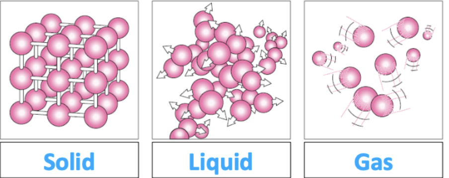
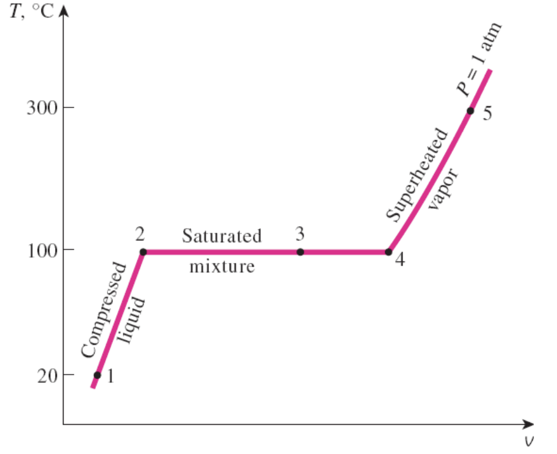
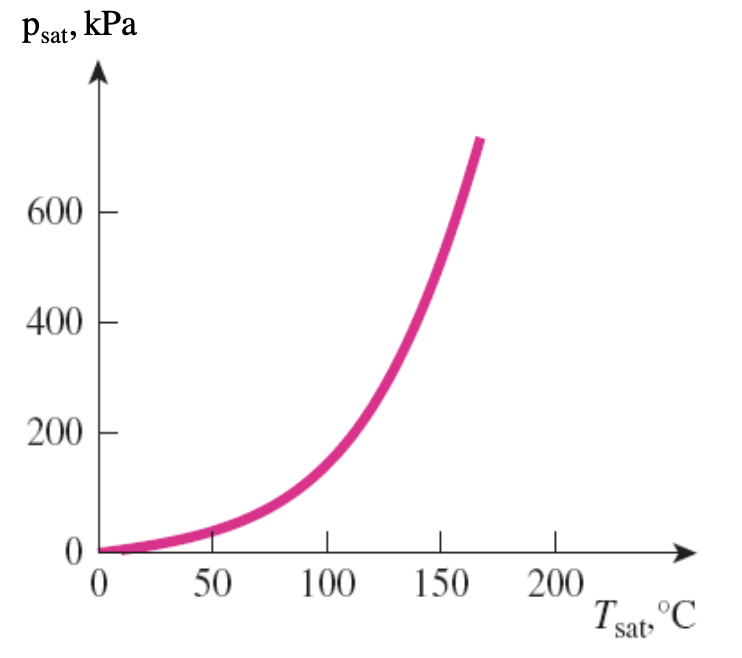
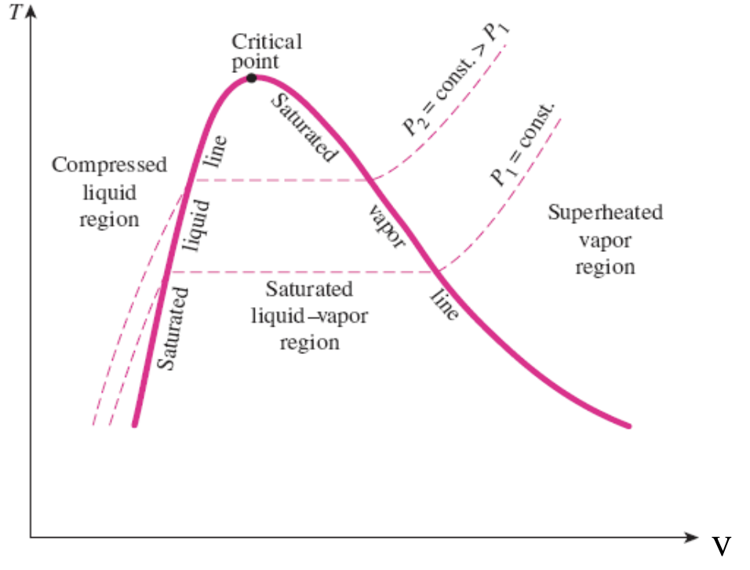
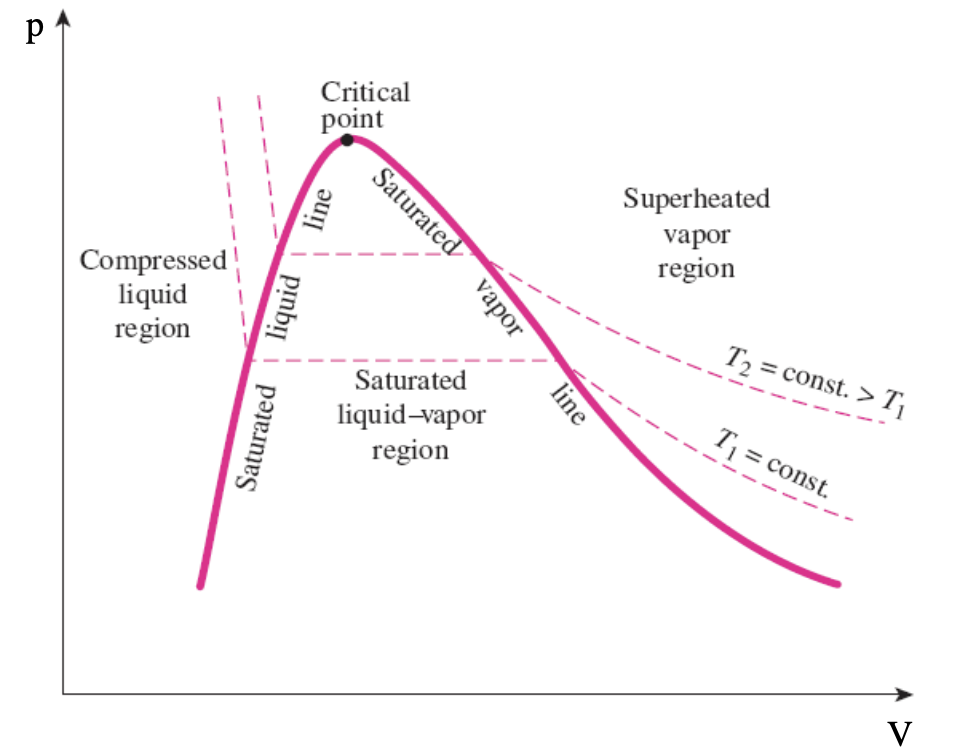

# XII: Substances,Phase Changes and Ideal Gases
## 1: Substances
### 1.1: Pure Substance
* A pure substance has a fixed chemical composition.
* A homogeneous mixture qualifies
### 1.2: Phases of Pure Substance
* Possible to have different molecular structure in the same phase, such as **graphite or diamond**.
* Molecules in a **solid** are kept in place by strong intermolecular forces.
* Weaker intermolecular force in a **liquid**.
* Molecules in a **gas** are further apart and move about at radom.
* 
* Phase equilibrium:
    * A system involves two phases and when the mass of each phase reached an equilibrium level asn stays on.
* State postulate
    * The state postulate for a simple, pure substance states that the equilibrium state can be determined by specifying any two independent intensive properties.
## 2: Phases of Changes
### 2.1: Phase-Change Processes 
* Example-Water:
**Compressed liquid** $\Rightarrow$ **Saturated Liquid** (About to vaporise) $\Rightarrow$ **Saturated liquid-vapour mixture** $\Rightarrow$ **Saturated Vapour** $\Rightarrow$ **Superheated vapour**
* 
### 2.2: Saturation Temperature and Saturation Pressure
* The temperature at which change occurs depends on the pressure.
* Saturation temperature $T_{sat}$
    * Temperature at which a substance changes phase at a given pressure.
* Saturation pressure $p_{sat}$
    * Pressure at which a substance changes phase at given temperature.
* 
### 2.3: Latent and Sensible Heat
* **Latent heat**:
    * Energy absorbed or released during a phase-change process:
    * $Q=m\lambda$
    * $\lambda$ is specific latent heat
* **Sensible heat**
    * Energy transferred in single phase resulting in temperature change.
    * $Q=mc\Delta T$
    * $c$ is specific heat capacity.
### 2.4: Property diagrams fro phase-change processes
* T-v or P-v diagram could be helpful.
* 
* 
## 3: Ideal Gases
### 3.1: Equation of State
* An equation of state(EOS) is any equation that relates the pressure, temperature and volume of substance.
* The simplest EOS is the ideal-gas equation of state.
* Boyle's Law:
    * p $\propto v^{-1}$ at constant $T$
* Charles's Law:
    * v $\propto T$ at constant $p$.
* Gay-Lussac's Law:
    * p $\propto T$ at constant $V$.
* Avogadro's Law:
    * 1 mol all gases at same T and P occupy same volume.
    * The volume of 1 mol of a gas is $V=24.5*10^{-3}$ L
    * Avogadro's constant: $n_A=6.022\times 10^{23}$ particles/mol
    * Molar mass:$m=n\widetilde{m}$
* Ideal gas law:
    * $pV=nR_0T$
    * $R_0=8.314$kJ/kmol K (Universal gas constant)
    * $R=\displaystyle\frac{R_0}{\widetilde{m}}$, **Special gas constant**
### 3.2: Real gases: other equations of state
$$
(p+\displaystyle\frac{a}{V^2})(V-b)=mRT
$$
## 4: Mixtures of Ideal Gases
### 4.1: Mole and Mass Fraction
* There is a mixture of ideal gases with a number of components($i=i...n$)
* Mass $m$ of mixture = sum of masses $m_i$ of components: $m=\Sigma _i m_i$
* Amount of substance $n$ of mixture = sum of $n_i$ of components: $n=\Sigma _i n_i$
* Mass (gravimetric or ultimate) fraction $Y_i$ and mole $X_i$ fraction:
    * **mass fraction**: $Y_i=\frac{m_i}{m}$
    * **mole fraction**: $X_i=\frac{n_i}{n}$
### 4.2: Molar Mass
$$
\widetilde{m_{mix}}=\displaystyle\frac{m}{n}=\displaystyle\frac{\Sigma_i m_i}{n}=\Sigma {X_i\widetilde{m_i}}
$$
### 4.3: Specific Heat Capacity
* It is the sum of the **heat capacities** of the components:
$$
m_{mix}c_{mix}=\Sigma_i{m_i c_i}
$$
$$
c_{mix}=\Sigma_i{\displaystyle\frac{m_1}{m_{mix}}c_i}
$$
$$
c_{mix}=\Sigma_i{Y_i c_i}
$$
### 4.4: Partial Pressure
* Define partial pressure using mole fraction: $p_i=X_ip$
* Total pressure is the sum of partial pressures: $p=\Sigma{p_i}$
* This is known as **Dalton's Law** fro am ideal gas.
### 4.5: Partial Volume
* $V_i=X_iV$
* $V=\Sigma V_i$
* This is **Amagat's Law** for a ideal gas.

