# XIV: The First Law 
## 1: First Law of thermodynamics
### 1.1: Definition
* Usually referred as the Law of Conservation of Energy: **Energy cannot be created or destroyed, but can be transformed from one state to another**.
### 1.2: Balance for a closed system
* 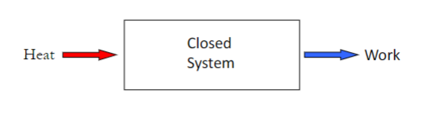
* $\Delta{E}=Q-W$ or $\Delta{E}=Q+W$
* $\Delta{E}=Q-W$, which is used for sign convention of Clausius.
* $E=U+KE+PE$
* $Q-W=\Delta U$
* We use specific terms(per unit mass):
$q-w=\Delta u$
### 1.3: Work for a closed system
* 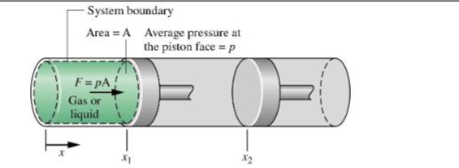
* Total work for the sum of all the little changes.
$\displaystyle\int_1^2pdV$
* 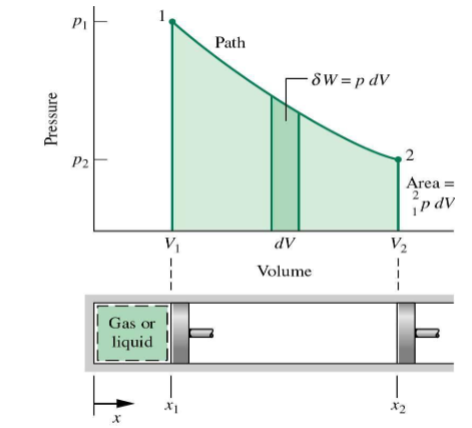
### 1.4: Enthalpy,H
* $H=U+PV$, where $U$ is internal energy and $PV$ is work of the fluid.
* It we marks the $q$ as the heat of a reaction:
$\Delta H=q$
* Note it is under the constant pressure conditions.
### 1.3: Specific heat capacity
* $Q=cm\Delta T$ or $q=c\Delta T$
* For ideal gases at constant volume: $\Delta U=c_vm\Delta T$
* Use the ideal gas law, $p\Delta V=mR\Delta T$
* Then, $Q=mc_v\Delta T+mR\Delta T$
* So we can find the specific heat capacity in constant pressure: $c_p=c_v+R=\displaystyle\frac{\Delta h}{\Delta T}$
* $H=U_pV$ and $h=u+pv$
## 2: Polytropic processes
### 2.1: Boundary work
* 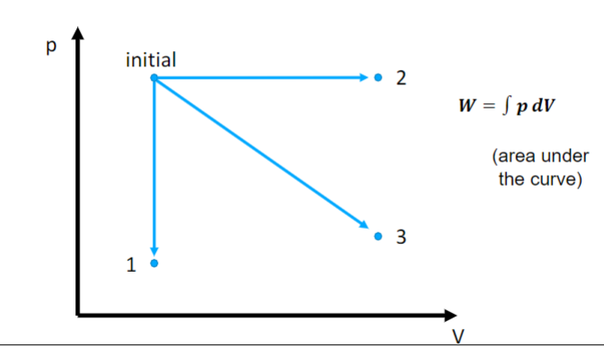
### 2.2: Isochoric process (V=constant)
* 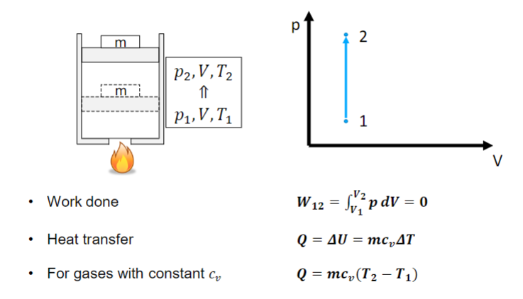
### 2.3: Isobaric process (P=constant)
* 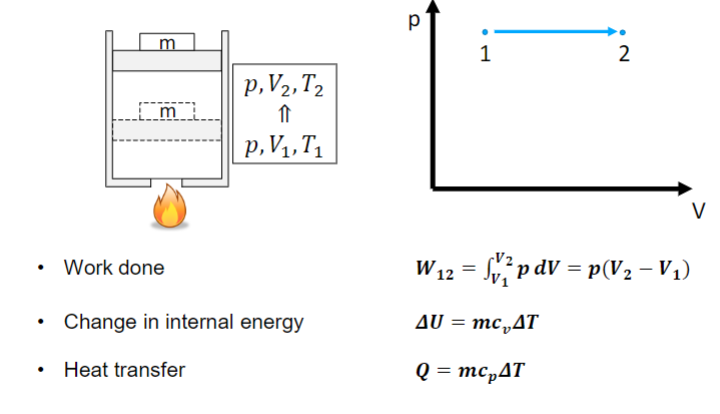
* 
### 2.4: Isothermal process (T=constant)
* 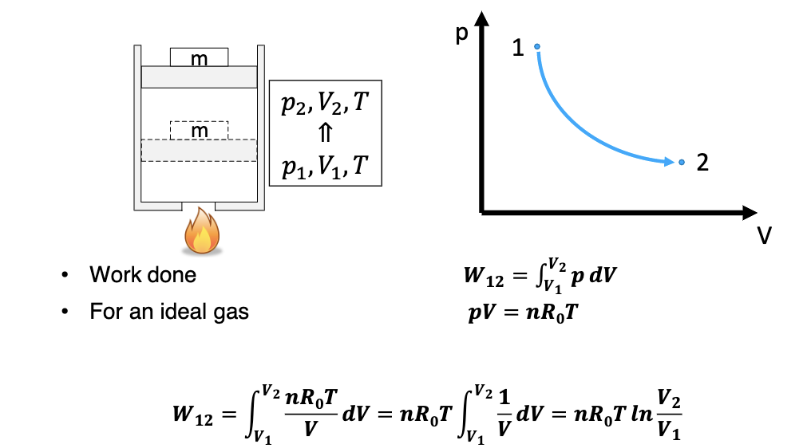
## 2.5: Polytropic process (multiple process)
 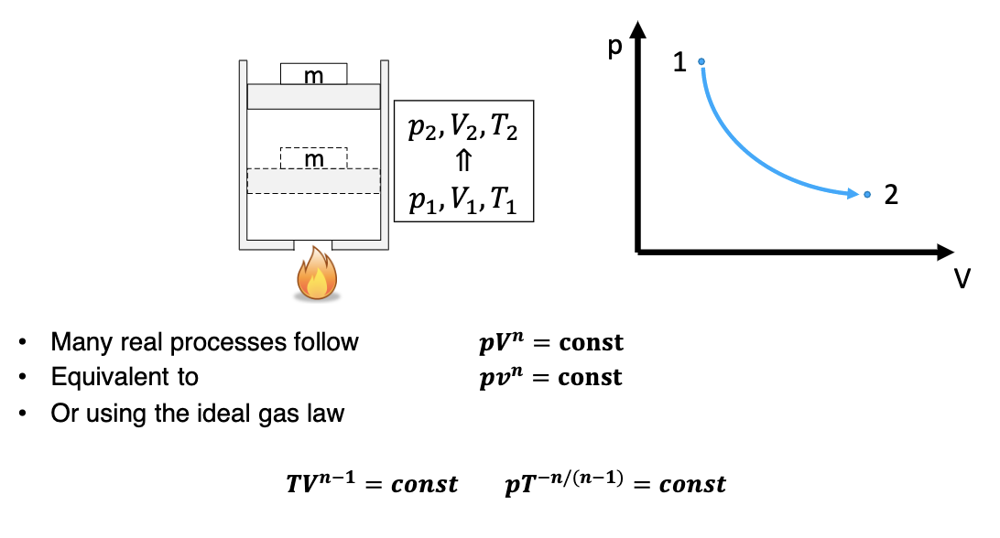 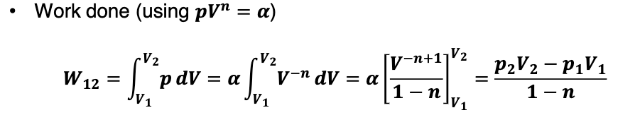
## 2.6: Isentropic process (entropy process)
* 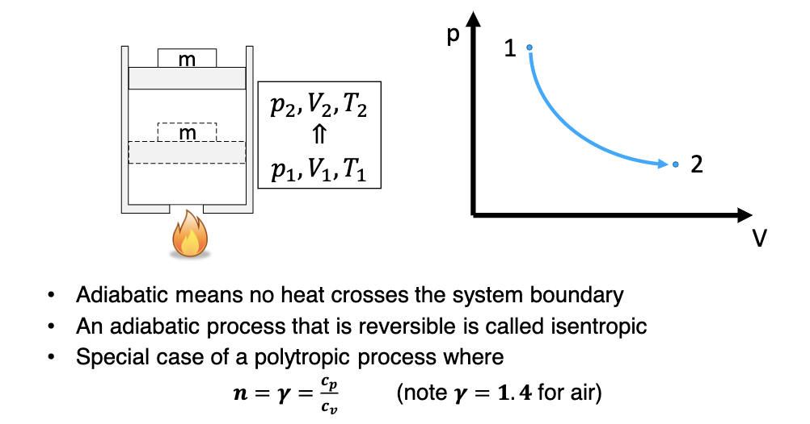
* 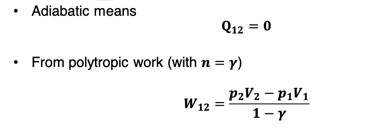
* 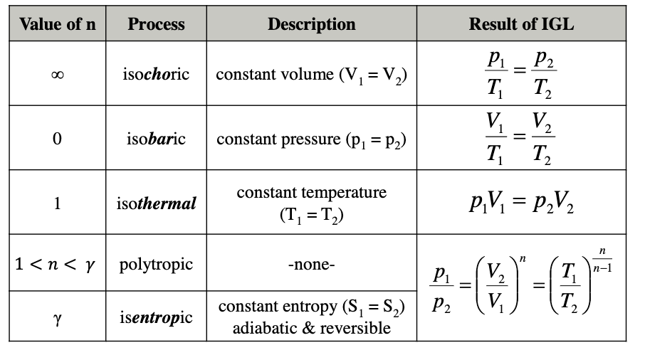
## 2.7: Polytropic work
* 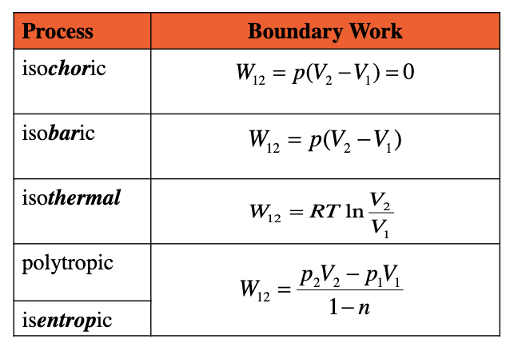