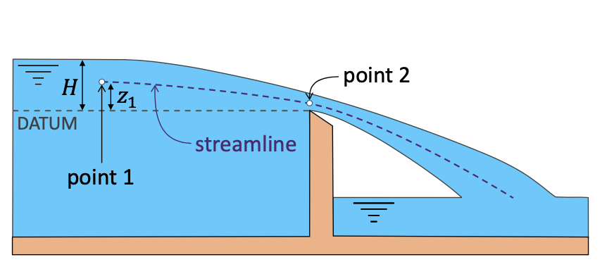
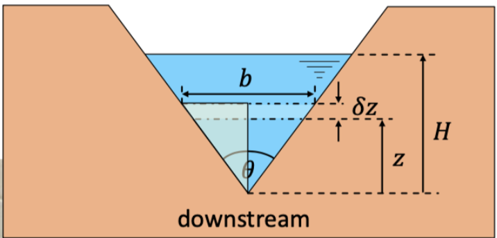
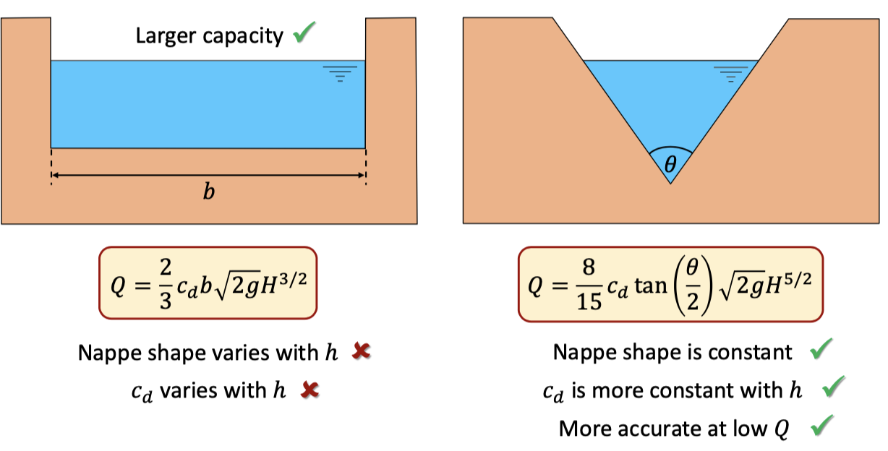
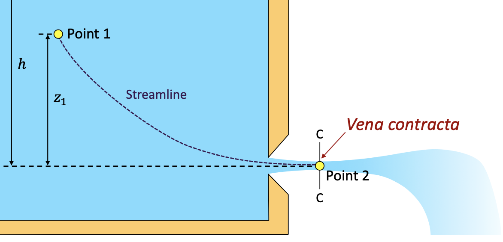

# XI: Flow Measurement: Weirs and Orifices
## 1: Weirs
### 1.1: Sharp-Crested Weir
* 
* Pressure head at point 1 = $H-z_1$, and point 2 is 0.
* According to the Bernoulli equation: $z_1+(H-z_1)+\displaystyle\frac{u_1^2}{2g}=z_2+0+\displaystyle\frac{u_2^2}{2g}$
* $u_2=\sqrt{2g(H-z_2)+u_1^2}$
* $\delta Q= b\delta z\sqrt{2g(H-z)+u_1^2}$
* Then we can do the integration to find the Q: 
$$
Q=b\sqrt{2g}\int_0^H{(H-z+\displaystyle\frac{u_1^2}{2g})^{1/2}}dz
$$
$$
Q=\displaystyle\frac{2}{3}c_db\sqrt{2g}({(H+\displaystyle\frac{u_1^2}{2g})^{3/2}-(\displaystyle\frac{u_1^2}{2g})^{3/2}})
$$
* $c_d$ is the coefficient of discharge, without $c_d$ the $Q$ is called the $Q_{ideal}$.
* If $u_1$ is very small, $Q=\displaystyle\frac{2}{3}c_db\sqrt{2g}H^{3/2}$
### 1.2: The Example of Sharp-Crested Weirs
* **Step 1**:
Neglect $u_1$ term using $Q=\displaystyle\frac{2}{3}c_db\sqrt{2g}H^{3/2}$, which could find $Q_1$.
* **Step 2**:
Using $u_1=\displaystyle\frac{Q_1}{A}$ to find $u_1$, then using the full formula to find $Q_2$.
* **Step 3**:
Using $u_2=\displaystyle\frac{Q_2}{A}$ to find $u_2$. then using the full formula to find $Q_3$.
### 1.3: V North Weir
* 
* $\delta Q_{ideal}=b\delta z\sqrt{2g(H-z)}$
* $Q=\displaystyle\frac{8}{15}c_d\tan(\displaystyle\frac{\theta}{2})\sqrt{2g}H^{5/2}$, for triangle.
* $Q=\displaystyle\frac{2}{3}c_db\sqrt{2g}H^{3/2}$, for rectangle.
* Advantages:
    * 
## 2: Orifices
### 2.1: Small Orifice
* 
* Bernoulli Equation:
$$
z_1+\displaystyle\frac{p_1}{\rho g}+\displaystyle\frac{u_1^2}{2g}=0+\displaystyle\frac{p_2}{\rho g}+\displaystyle\frac{u_2^2}{2g}
$$
* Cause $\displaystyle\frac{u_1^2}{2g}$=0, $\displaystyle\frac{p_2}{\rho g}$=0, we can find:
$$
h=\displaystyle\frac{u_2^2}{2g}
$$
* I.e, $u_2^2=\sqrt{2gh}$
* $Q=c_cAu_2=c_cA\sqrt{2gh}$, $c_c=$area of vena contracta/ area of orifice.
### 2.2: Large orifice
* 
* $\delta Q_{ideal}=b\delta z\sqrt{2g(H-z)}$
* Then we can find that: 
$$
Q=\displaystyle\frac{2}{3}c_db\sqrt{2g}({(H+\displaystyle\frac{d}{2})^{3/2}-(H-\displaystyle\frac{d}{2})^{3/2}})
$$