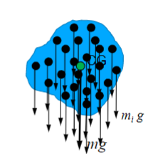
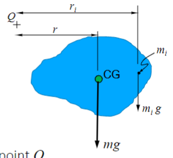
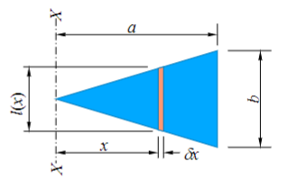
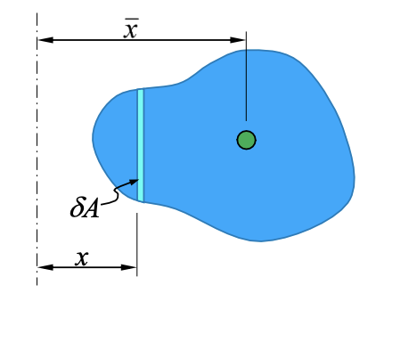

# I: Introduction to Dynamics
* Draw the free body diagram
* Newton's second Law in each direction.
* Non-rotational: $\Sigma F=m\ddot{x}$ and $\Sigma M=0$
* Rotational: $\Sigma M \not ={0}$. Note that the moment is about the **centre of mass**.
# II: Body Forces
## 1: Introduction of Body force
* A **external force** acts throughout the volume of a body.
* Force due to gravity, electrical fields and magnetic fields are examples.
* Note that **Normal forces and surface forces instead of body forces**.
* Body forces act on all particles making up a body.
* 
* For a rigid body, these behave as a single force acting through a point.
* Centre of mass = Centre of Gravity
## 2: Centre of mass
* 
* Each part feels a force $F_i=m_ig$
* Each part feels a moment $M_i=m_igr_i$ about any point $Q$.
* $\displaystyle\Sigma {M_i}=g\displaystyle\Sigma{m_ir_i}=mgr$
* So $mr=\displaystyle\Sigma{m_ir_i}$, this is the **$1^{st}$ moment of mass**, which can be used to located the centre of mass.
## 3: Examples of finding the centre of mass
### 3.1: Example_1
* A uniform, triangular plate, with thickness $t$ and density $\rho$.
* Define an element of width $\delta x$, a distance $x$ from an axis $XX$.
* 
* The length of element can be written as $l(x)=\displaystyle\frac{b}{a}x$
* The mass can be expressed as $\delta x=\rho t\displaystyle\frac{b}{a}x\delta x$
* So the first moment of the element about the axis $XX=\displaystyle\frac{1}{3}$
* And for the whole body integration $=\displaystyle\int_{x=0}^{x=a}{\rho t\displaystyle\frac{b}{a}x\delta x}=\displaystyle\frac{1}{3}\rho tba^2$
* $mr=\displaystyle\frac{1}{3}\rho tba^2$, so $r=\displaystyle\frac{1}{3}a$
### 3.2: Centre of gravity, Centre of mass and Centroid
* Centre of mass, centre of gravity and centroid are not the same thing.
* Assume uniform gravitational field, so **centre of gravity =centre of mass**.
* Centroid is obtained from **first moment of area**: $\displaystyle\Sigma{\delta A.x}=A\bar{x}$
* 
* centroid = centre of mass if $t$ and $\rho$ are uniform.

