<!--
# IX: Introduction to vibration
## 1: Vibration Basic
* Cyclic motion 
* Responses to cyclic forces
### 1.1: Context 
* Low frequency - Ship motions
* Medium Frequency - machine vibration
* High Frequency - Noise
### 1.2: Definition 
* **Cycle period, T**
* **Frequency,f (cycle per second, Hz)**
$$
T=\frac{1}{f}
$$
* **Cycle (or cycle per second, Hz)**
$$
\begin{align*}
   \omega &=2\pi f \\
&= \frac{2\pi}{T}
\end{align*}
$$
* **Response of System**
   * Complex numbers,addition of sin and cos and single sin or cos with phase angle can be used to express the response.
   * In this module we will use cosine and phase to express, as $f(x)=A\cos(\omega t+\phi)$.
### 1.3: Vibration Algorithm
* Draw FBD and set up EOM.
* Assume the periodic form of solution and differentiate to give periodic velocity and acceleration.
* Put solution and derivate into EOM and set conditions to solve unknowns.
* Observe and plot the system response.
## 2: Free Undamped Vibration
* Free means no **additional forces** acting on the systems and undamped means there is no **resistance** to the vibration motion.
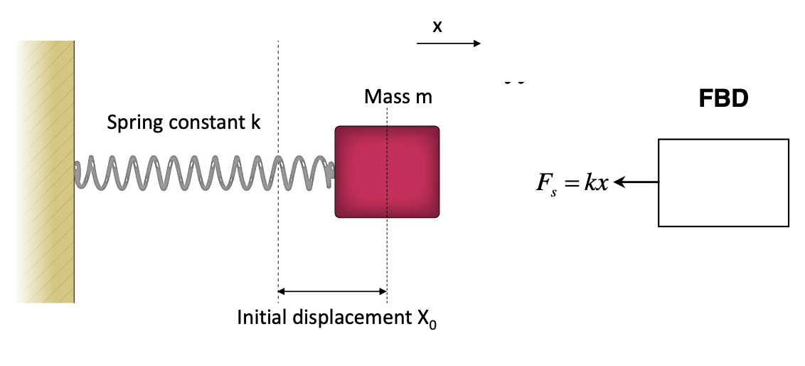
* The body only have one **restoring force**, which is always negative.
* According to Newton's second Law, we can set up the equation of motion:
$$
-kx=m \ddot{x}
$$
* If we use cos with phase as the vibration:
$$
x=X_0\cos{(\omega t)}
$$
* We can get:
$$
-m\omega ^2 X_0 \cos{(\omega t)}+kX_0\cos{(\omega t)}=0 \\
\omega _n=\sqrt{\frac{k}{m}}
$$
* The $\omega _n$ is the **natural frequency**.
## 3: Other Vibration Examples 
### 3.1:  Common Forced Vibration 
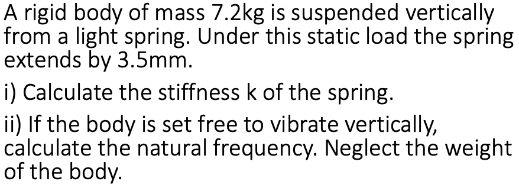
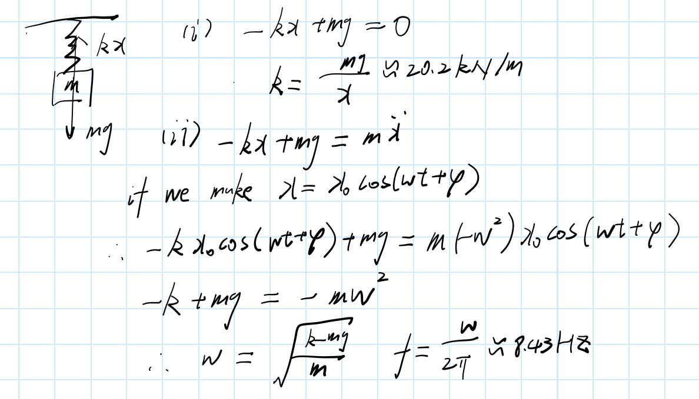
### 3.2: Vibration with different conditions 
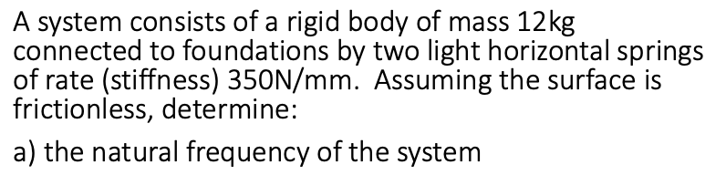
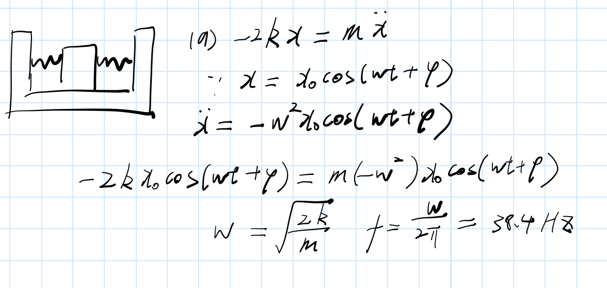
**(i) If starting from rest with a displacement of 0.2 mm from the equilibrium position**

**(ii) If starting from the equilibrium position with a velocity of 0.25 m/s**
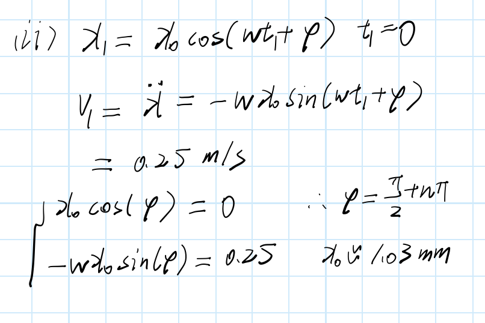
**(iii) If starting from a point 0.05 from the equilibrium position with a velocity of 0.15m/s**
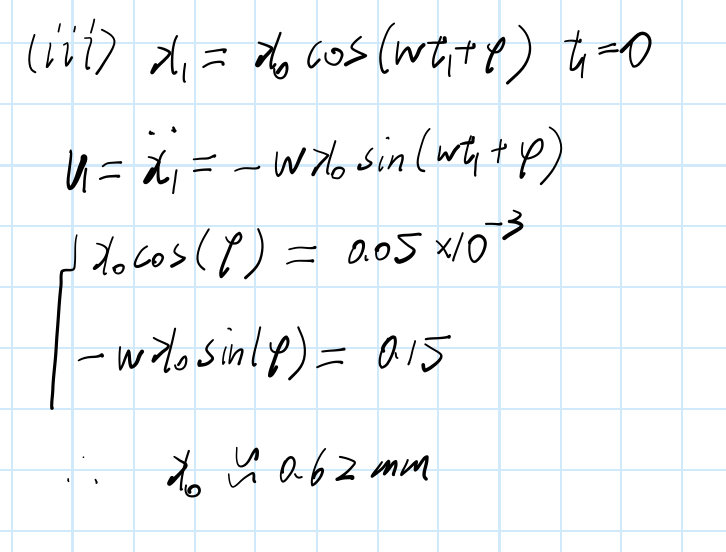
### 3.3: Rotational Examples 
**Example_1:**
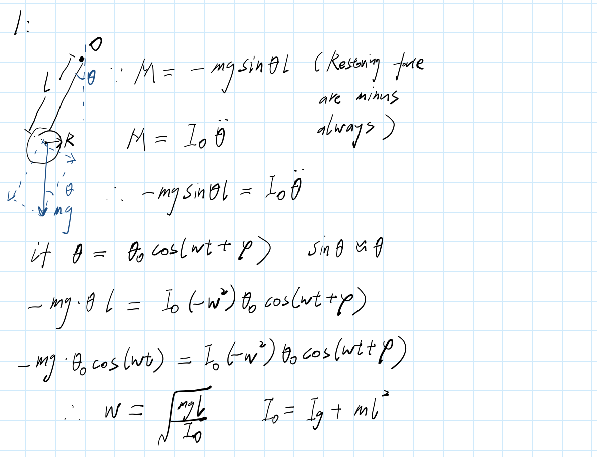
**Example_2:**
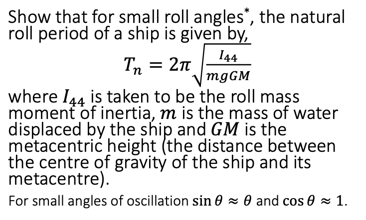
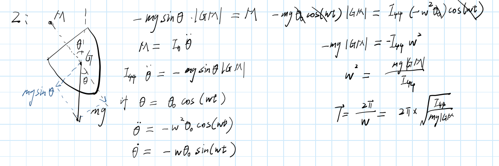
-->
## 4: Forced undamped vibration
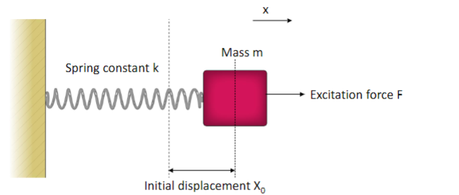
* The system is now acted on by a periodic force (**Excitation force**):
$$
F=F_0\cos(\omega t)
$$
* If we consider the static condition firstly:
$$
X_{static}=\frac{F_0}{k}
$$
* To start with the EOM:
$$
F_0\cos(\omega t)-kx=m\ddot{x}(t)
$$
* If we assume the equation of x:
$$
x=X_0\cos(\omega t_\phi)
$$
* The substitution occurs as:
$$
F_0\cos(\omega t)-kX_0\cos(\omega t+\phi)=-m\omega ^2\cos(\omega t+\phi)
$$
* As the equation above is satisfied in all situations, so we assume $\omega t=\frac{\pi}{2}$, and we find that $\phi=0$. So there is no phrase.
* Then we got:
$$
\frac{X_0}{F_0}=\frac{1}{k-m\omega ^2}
$$
* If we use the conditions we got previously:
$$
x_{static}=\frac{F_0}{k}\\
\omega _n=\frac{k}{m}   
$$
* We got the **Magnification factor**:
$$
\begin{align*}
   M &=\frac{X_0}{x_{static}} \\
   &=\frac{1}{1-(\frac{\omega}{\omega _n})^2} \\
\end{align*}
$$
* When $\omega\rightarrow\omega _n$, we have the resonance.
* The amplitude ($X_0$) is maximized when $\omega$ is minimized or $F_0$ maximized.
* If we plot the result:
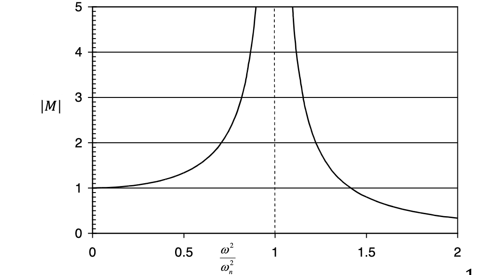
* Another way of looking at the effect of the forcing term is **transmissibility (T)**.
* **T** looks at how much of forcing term is transmitted to the system.
* Force transmitted is connected to the spring force:
$$
F_s=kx=kX_0\cos(\omega t)  
$$
* Transmissibility is defined as the ratio of the amplitude of the force transmitted to he amplitude of the applied force:($F_0$ as external force)
$$
T=\frac{kX_0}{F_0}
$$
* As we defined $M=\frac{X_0}{F_0/k}$, so:
$$
T=\displaystyle\frac{1}{|1-\frac{\omega ^2}{\omega _n^2}|}
$$
## 5: Forced Damped Vibration
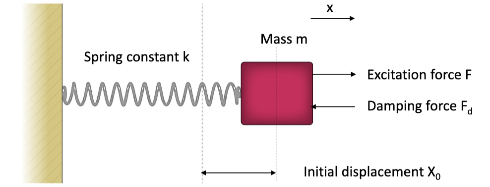
* The system is acted on a periodic force (**excitation force**) $F=F_0\cos\omega t$ and there is a damping force which opposes motion.
* We assume that the damping is proportional to velocity (linear damping):
$$
F_d=-C\dot{x}
$$
* Damping is characterized by $C$ the **Damping Coefficient**
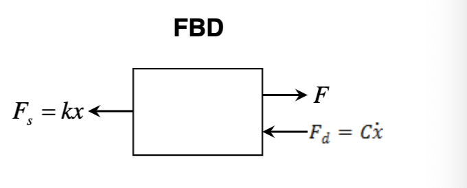
* Firstly, the equation of motion:
$$
F-kx-C\ddot{x}=m\ddot{x}
$$
* Taking the steady sate form of the excitation force and system response:
$$
F=F_0\cos(\omega t) \\
x=X_0\cos(\omega t+\phi) \\
$$
* The do the substitution:
$$
-mX_0\omega ^2\cos(\omega t+\phi)-CX_0\omega\sin(\omega t+\phi)+kX_0\cos(\omega t+\phi)=F_0\cos(\omega t)
$$
* If we set $\omega t=\frac{\pi}{2}$ to find the $\phi$:
$$
-(-m\omega ^2+k)\sin(\phi)-C\omega\cos(\phi)=0 \\
\tan(\phi)=\frac{-C\omega}{(-m\omega^2+k)} \\
$$
* By setting $\omega t=0$:
$$
\displaystyle\frac{X_0}{F_0}=\displaystyle\frac{1}{(-m\omega ^2+k)\cos(\phi)}
$$
* Use the former result of tangent of $\phi$:
$$
\displaystyle\frac{X_0}{F_0/k}=\displaystyle\frac{1}{\sqrt{(1-\frac{\omega^2}{\omega _n^2})^2 +(\frac{C}{m\omega_n})^2\frac{\omega^2}{\omega _n^2}}}
$$
* If we plot the result:
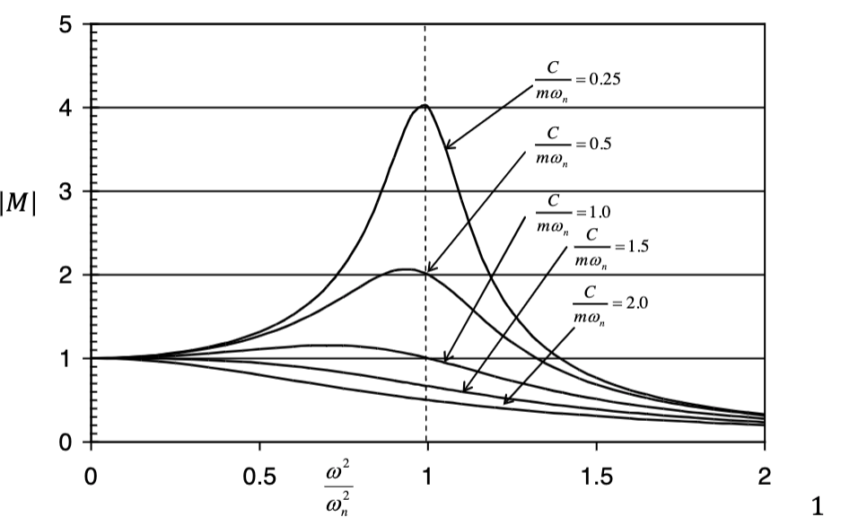
## 6: Unforced (Free) damped vibration
* Physically we know that the amplitude will decay exponentially with time:
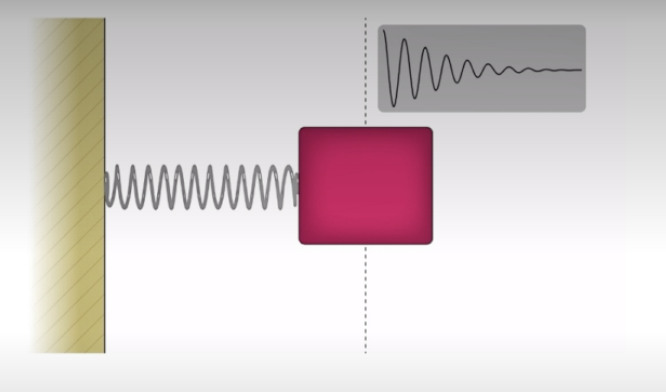
* So $X\rightarrow Xe^{-nt}$, where n is an unknown constant.
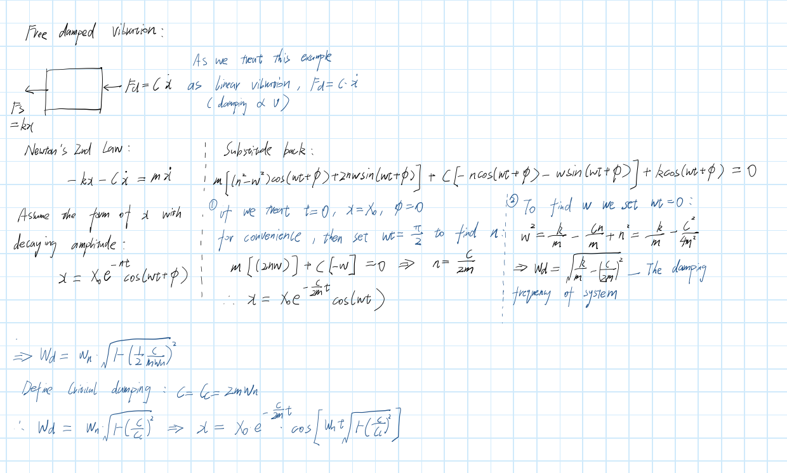
## 7: Types of Damping Coefficient
### 7.1: Critically damped
* The system is at the limit of vi
* vibration:
$$
\frac{C}{C_c}=1
$$
### 7.2: Over damped
* The system does not vibrate and return to equilibrium:
$$
\frac{C}{C_c}>1
$$
### 7.3: Under damped
* The system vibrates with reducing amplitude at a reduced frequency:
$$
\frac{C}{C_c}<1
$$

