# VII: Power and Speeds
## 1: Introduction
* Power: rate of energy flow , rate of doing work
* SI units: J/S or W
* Various forms:
    * Mechanical_linear: $Fv$ or $F_x\displaystyle\frac{dx}{dt}=F_x\ddot{x}$
    * Mechanical_rotary: $\omega T$ or $T\displaystyle\frac{d\theta}{dt}=T\ddot{\theta}$
    * Fluid: $\dot{Q}\Delta P$
    * Electrical:$VI$
## 2: The use of gearbox
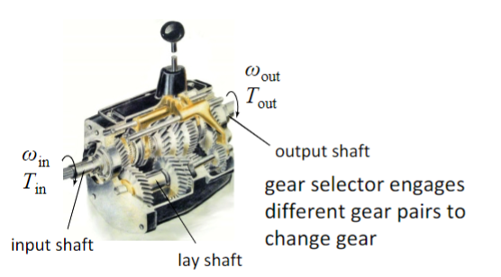
* According to conservation of energy, $\omega_{in}T_in=\omega_{out}T_{out}$, if neglecting the losses.
* I.C engines cannot run at very high speed and cannot gain high torque at low speed.
## 3: Design machines to deliver high power 
### 3.1: IC engine
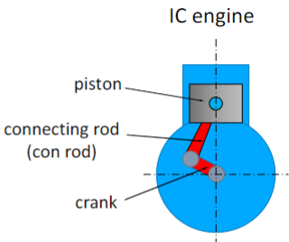
* In order to deliver high power, we need higher speed or higher torque, so we need large forces and vibration.
* We use big pistons and big crank.
### 3.2: Electrical Motor
* We use small diameter rotor, which is compact and can be run at high speed.
* The pancake motor, large diameter and low speed.
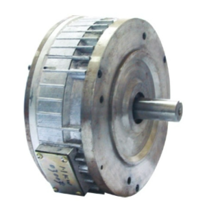
# VIII: Mechanical drives: Gears
## 1: Gear Kinematic
### 1.1: Introduction
* Modern gears evolved from ancient cogs, such as the cog in the windmill.
* 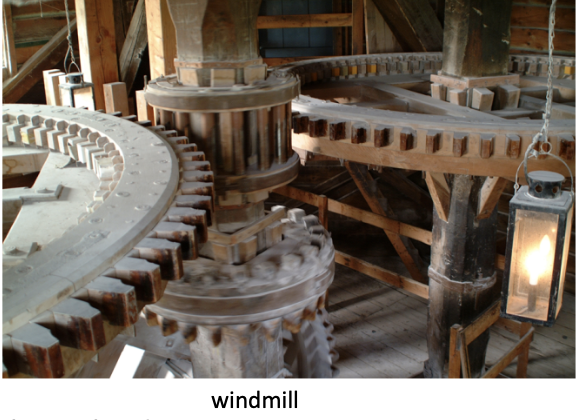
* The problem is the rapid wear limits load and uneven speed.
* The modern way to solve these problems: rapid wear limits load, uneven running speed (involute tooth forms)
### 1.2: Speed ratio
* Gears behave as perfect friction wheels.
* Tangential velocity is same for both gears, i.e.:(minus means different directions)
$$
v=R_1\omega_1=R_2(-\omega _2)
$$
* So we can find the gear or speed ratio:
$$
\frac{\omega _2}{\omega _1}=-\frac{R_1}{R_2}
$$
* How to measure pitch circle radius R (or pitch diameter):
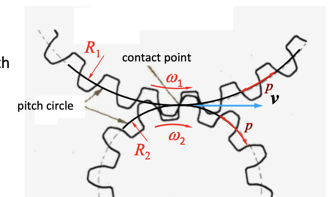
$$
N_1p=2\pi R_1 \\
N_2p=2\pi R_2 \\
\frac{R_1}{R_2}=\frac{N_1}{N_2}
$$
* So we can find the speed ratio just by the **teeth N**.
## 2: Types of Gears
### 2.1: Spur Gears
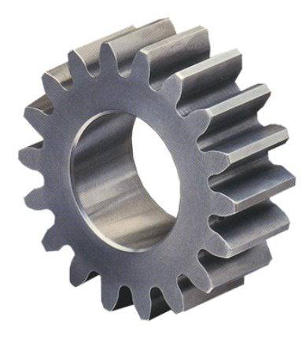
* Teeth cut parallel to the axis.
* Cheap and easy to make.
* Noisy.
### 2.2: Helical Gears
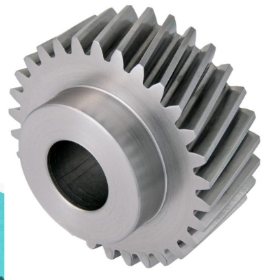
* Teeth cut at an angle to the axis.
* Can still be made by hobbing.
* Quiet.
* Introduce to an axial force.
### 2.3: Double helical gears
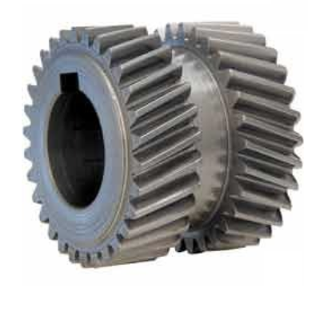
* Very quiet.
* No axial force.
* Expansive.
### 2.4: Internal gears
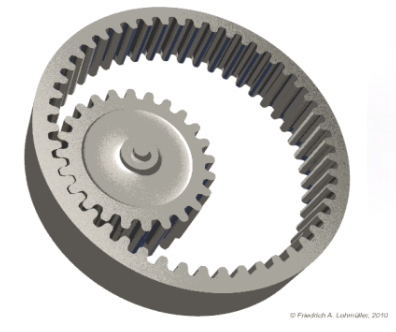
* Straight or helical.
* Difficult to make.
### 2.5: Bevel Gears
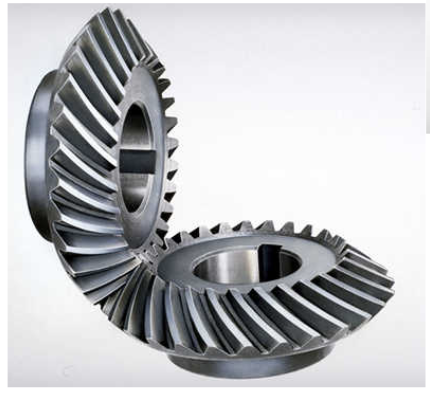
* Rotating transmission axis.
* Straight or helical.
## 3: Torque Transmission through gears
### 3.1: Consider only the pair of teeth in contact
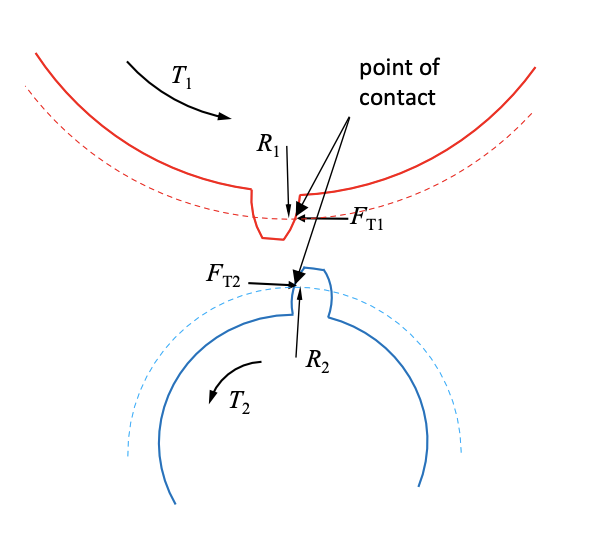
* Tangential force $F_{T1}$ and $F_{T2}$ are equal but opposite.
* Taking moments about the gear centres:
$$
T_1-F_{T1}R_1=0 \\
T_2-F_{T2}R_2=0 
$$
* Then we get the Torque ratio:
$$
\frac{T_2}{T_1}=\frac{R_2}{R_2}=\frac{N_2}{N_1}
$$
* According to former equation, we can find that:
$$
\omega_1 T_1=\omega_2 T_2
$$
* Which means power in = power out.
* In practice, there is a small loss of power due to friction:
$$
\omega_{in}T_{in}>\omega_{out}T_{out} \\
\frac{\omega_{in}}{\omega_{out}}=\frac{N_{out}}{N_{in}} \\
\frac{T_{out}}{T_{in}}=\eta\frac{N_{out}}{N_{in}}
$$
* $\eta$ is the efficiency.
### 3.2: Muti-stage Gears: Idler gears
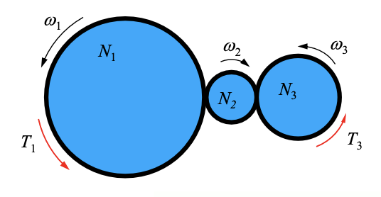
* It is found that:
$$
\frac{\omega _3}{\omega _1}=\frac{N_1}{N_3} \\
\frac{T_3}{T_1}=\frac{N_3}{N_1}
$$
* So the idler gear has no effect on speed or torque, **but is used to increase the distance between gear axes and to change direction of rotation.**
* In fact, it will increase the losses.
### 3.3: Multi-stage Gears: Double reduction gears
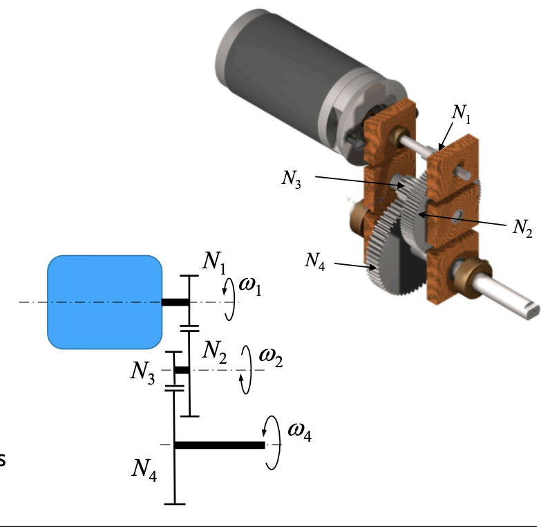
$$
\frac{\omega _2}{\omega _1}=-\frac{N_1}{N_2} \\
\frac{\omega _3}{\omega _4}=\frac{\omega _4}{\omega _3}=\frac{\omega _4}{\omega _2}
$$
* So we can get:
$$
\frac{\omega _4}{\omega _1}=\frac{N_1N_3}{N_2N_4} \\
\frac{T_4}{T_1}=\frac{N_2N_4}{N_1N_3}
$$
* Space/weight saving 
* Extra complexity 
* Extra friction losses (two meshings, so two losses)
## 4: Gear dimensions
* Tooth length is important.
* Tooth size is defined by **pitch length p**, but it is difficult to measure.
* Define **module**= $\displaystyle\frac{pitch\quad diameter}{number\quad of\quad teeth}=\displaystyle\frac{D_p}{n}$.
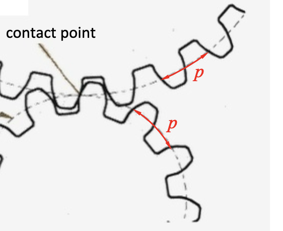
* Pitch circle circumference = $\pi D_p=pn$
* So module=$\frac{p}{\pi}$
* By gears by module and number of teeth.
* Gears of the same module will mesh together.