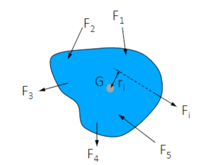
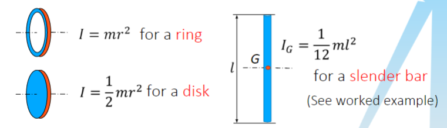
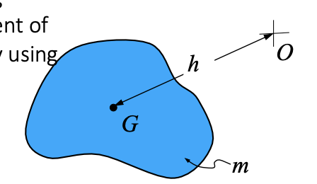
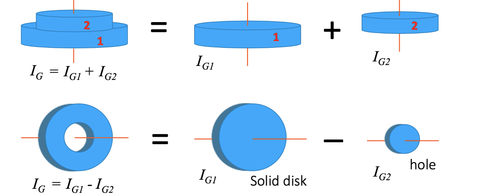

<!--
# III: Rotational Dynamics
## 1: Introduction
* Kinematic: study motion only
* Kinetics: force and torque causing the motion
## 2: Angular acceleration and moment of inertia
### 2.1: Angular acceleration
* In rotation, the displacement will be $\theta (rad)$, so velocity will be $\dot{\theta}(rad/s)$, and the acceleration will be $\ddot{\theta}(rad/s^2)$
* Angular acceleration is related to applied torque.
* In fact, $T=k\ddot{\theta}$.
* $k$ is the **moment of inertia I**, which has SI unit of $kg/m^2$.
### 2.2: Moment of inertia
* Compared with $F=ma=m\ddot{x}$, we can say $T=I\ddot{\theta}$ 
* $I$ play a role as the **mass** in translational motions.
* If a body rotating about its Centre of Gravity:
    * 
    * $\displaystyle\Sigma M_G=\displaystyle\Sigma F_ir_i=I_G\alpha$
    * Note that we use $\alpha$ to express the angular acceleration.
* The general definition of moment of inertia: $I_A=\displaystyle\Sigma r_i^2\delta m_i^2$
* I.e. $I_A=\displaystyle\int r^2 dm$
* Some applications:

-->
## 3: Parallel-Axis Theorem
* If the moment of inertia of the body about an axis passing through the mass centre is known, then the moment of inertia about other *parallel* axis can be determined by using the *parallel-axis theorem*.
* 
* $I_O=I_G+mh^2$
## 4: Moment of inertia operations
* The moment of inertia of the body can be determined by adding or subtracting.
* 
