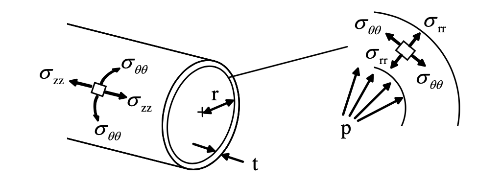
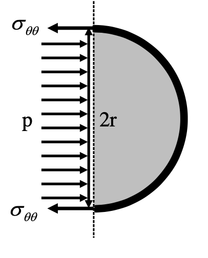
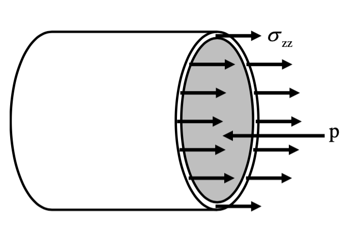
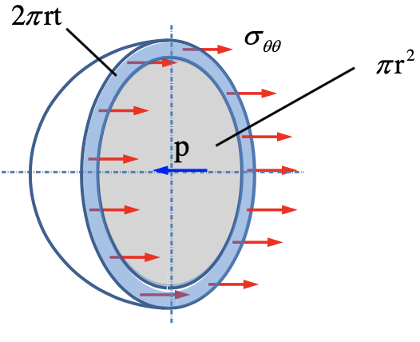

# V: Thin-walled pressure vessels
## 1: Introduction
* Thin-walled pressure vessels can be defined as closed structures containing fluids.
* The term thin-walled refers to the radius being greater than ten times that of the wall thickness.
## 2: Thin-walled cylindrical pressure vessels under internal pressure
* For a thin-walled cylindrical pressure vessel of radius $r$ and wall thickness $t$ subjected to a uniform internal pressure $p$.
* Three normal stresses arise:
    * Hoop stress, $\sigma_{\theta\theta}$
    * Axial stress, $\sigma_{zz}$
    * Radial Stress, $\sigma_{rr}$
    * 
* Hoop Stress:
    * Consider the half od the vessel with unit length in $z$ direction, we only consider the horizontal component of the internal pressure force (have effect to the wall) and $p$ also have vertical components.
    * 
    * $(\sigma_{\theta\theta}\times (t\times 1))+(\sigma_{\theta\theta}\times (t\times 1)=p\times (2r\times 1)$
     $$
    \sigma_{\theta\theta}=\displaystyle\frac{pr}{t}
     $$
* Axial stress:
    * Now consider the equilibrium in the horizontal direction.
    * 
    * $\sigma_{zz}=(2\pi r\times t)=p\times\pi r^2$
     $$
     \sigma_{zz}=\displaystyle\frac{pr}{2t}
     $$
* $\sigma_{\theta\theta}=2\sigma_{zz}$
* Radial stress:
    * The stress in radial direction $\sigma_{rr}$.
    * Varies from $-p$ in the inner surface to 0 in the outer surface.
* Comparison of stresses:
    $\sigma_{\theta\theta}>\sigma_{zz}>\sigma_{rr}\approx 0$
* Principal stresses:
    * The hoop stress is the max principal stress: $\sigma_{\theta\theta}\sigma_1$
    * The axial stress is the min principal stress: $\sigma_{zz}=\sigma_2$
    * The radial stress is the third stress: $\sigma_{rr}=\sigma_3=0$
## 3: Stress-strain relations
* As we know: $\varepsilon_1=\displaystyle\frac{1}{E}(\sigma_ 1-\nu\sigma_ 2)$
* $\varepsilon_2=\displaystyle\frac{1}{E}(\sigma_2-\nu\sigma_1$
* Substitute $\sigma_{\theta\theta}=\sigma_1$ and $\sigma_{zz}=\sigma_2$, we can find the relation of thin-wall condition.
* The change in diameter of cylinder, with original diameter $D$ is: $\Delta D=D\varepsilon_{\theta\theta}$
* The change in length of the cylinder, with original length $L$, is $\Delta L=L\varepsilon_{zz}$
* Use the **partial differential** : $\delta z\approx \displaystyle\frac{\partial f}{\partial x}\delta x+\displaystyle\frac{\partial f}{\partial y}\delta y$
* We can find $\Delta V=\displaystyle\frac{\pi D^2L}{4}(2\varepsilon_{\theta\theta}+\varepsilon_{zz})$
## 4: Thin-walled spherical pressure vessels under internal pressure
* 
* The equilibrium in the horizontal :
$\sigma_{\theta\theta}\times2\pi rt=p\times\pi r^2$, so $\sigma_{\theta\theta}=\displaystyle\frac{pr}{2t}$
* In thin-walled spherical pressure vessels, the stress is same in all directions.
* On the outer surface, every plane and direction are principal, thus, $\sigma_1=\sigma_2=\displaystyle\frac{pr}{2t}$ and $\sigma_3=0$
* Since the $\sigma_1$ and $\sigma_2$ are same sign, we can find that :
$\tau_{max}=\displaystyle\frac{\sigma_1-\sigma_3}{2}=\displaystyle\frac{pr}{4t}$
* Note that all the shear stress are zero in-plane.
* On the inner surface of the spherical shell, the principal stresses are:
$\sigma_1=\sigma_2=\displaystyle\frac{pr}{2t}$ and $\sigma_3=-p$
* The max shear stress which is out of plane:
$\tau_{max}=\displaystyle\frac{\sigma_1-\sigma_3}{2}=\displaystyle\frac{pr}{4t}+\displaystyle\frac{p}{2}$
* Since r/t is large, we can consider that the max shear stress inner is same as outer.
     