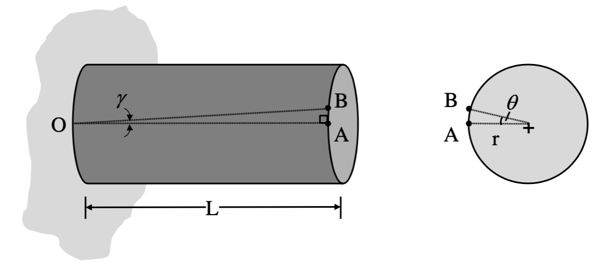
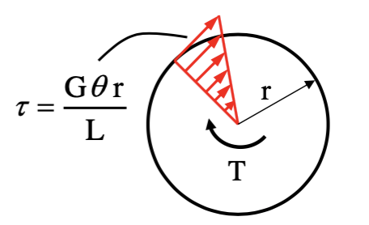
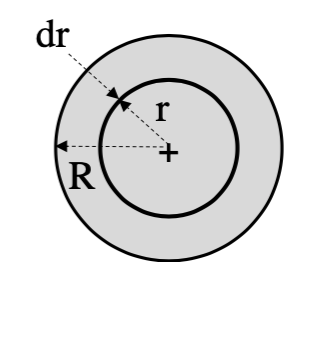
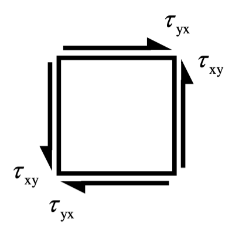

# VI: Torsion of shafts
## 1: Introduction 
* Torsion refers to the twisting of a straight shaft or bar when ist is subjected to a torque(s) which results in rotation about the longitudinal axis and induces shear stress.
## 2: Basic theory of torsion 
### 2.1: Basic concepts
* Consider a solid shaft fixed at one end and twisted at the other end due to a torque $T$.
* 
* The original shaft line $OA$ rotates through a angle $\gamma$ and form a new triangle $OAB$.
* $\tan{\gamma}=\displaystyle\frac{l_{AB}}{L}$
* Since the **angle $\gamma$ is very small**, we can use **$\tan{\gamma}=\gamma$**.
* So $l_{AB}=L\gamma$
* At the cross section area, $l_{AB}=r\theta$
* Then $L\gamma=r\theta$
* $\gamma=\displaystyle\frac{r\theta}{L}$
* Recall the relationship between shear stress and shear strain:
$$
G=\displaystyle\frac{\tau}{\gamma}\Rrightarrow\gamma=\displaystyle\frac{\tau}{G}
$$
* Finally, we can find:
$$
\tau=\displaystyle\frac{G\theta r}{L}
$$
### 2.2: Basic concepts_2
* As the equation show, the shear stress is zero at the centre and reach to the max at the outer of the shaft.
* 
* Consider a ring of material with the thickness $dr$ and a radius $r$ and $R$.
* 
* $dA=2\pi r\times dr$
* Thus, the force acting on the ring of material:
$$
dF=\tau\times dA=\tau\times 2\pi rdr
$$
* $dT=dF\times r=\tau \times 2\pi rdr \times r$
* It can be simplified to :
$$
dT=\displaystyle\frac{G\theta}{L}2\pi r^3dr
$$
* The torque for the entire cross-section can be determined as:
$$
T=\displaystyle\frac{G\theta}{L}2\pi \int_0^R{r^3dr}
$$
* In this equation, the term $J$ is call **polar second moment of area**. 
$$
J=2\pi \int_0^R{r^3dr}
$$
$$
T=\displaystyle\frac{G\theta}{L}J
$$
or
$$
\displaystyle\frac{\tau}{r}=\displaystyle\frac{G\theta}{L}=\displaystyle\frac{T}{J}
$$
### 2.3: The restriction of the formula
* The shaft is straight and of uniform cross-area over the length.
* The torque is constant.
* The cross-section remains circular after the torque applied.
* Radial line remains radial.
* Plane remain normal to the longitudinal axis of the shaft.
## 3: Torsional stiffness
* The torsional stiffness, $k_t$ is defined as:
$$
k_t=\displaystyle\frac{T}{\theta}=\displaystyle\frac{GJ}{L}
$$
## 4: Polar second moment of area
* For a hollow circular shaft with internal diameter $D_i$ and external diameter $D_o$:
$$
J=\displaystyle\frac{\pi (D_o^4-D_i^4)}{32}
$$
## 5: Principal stresses and max shear stress
* 
* For the pure shear stress case ($\sigma_{xx}=\sigma_{yy}=0$ and $\tau_{xy}\not ={0}$), if we use the stress transformation equations, we obtained:
$$
\sigma_{\theta}=\tau_{xy}\sin{2\theta}
$$
$$
\tau_{\theta}=\tau_{xy}\cos{2\theta}
$$
* For max shear stress, $\tau_{max}$ occurs when $\theta=0$ (vertical)
* For principal stresses:
    * Max occurs when $\theta=45$
    * Min occurs when $\theta=-45$
* Since the principal stresses acts at 45 and -45 to the maximum shear stress, strain gauges are usually mounted at 45 to a shaft's longitudinal axis so that the principal strains can be measured directly, which can be used to determine the principal stresses.
## 6: Torsion failure modes
* In uniaxial tension case the ductile materials fail on a plane of maximum shear stress (45 from the vertical), whereas the brittle materials fail on planes of maximum normal stress.(0 from vertical)
* When subjected to torsion, ductile materials will fails on max shear stress, however the max shear stress acts on 0 degrees from the vertical (perpendicular to shaft's longitudinal axis).
* Subjected to torsion, the brittle materials will fail on planes of max normal stress which is 45 degrees from the vertical.
